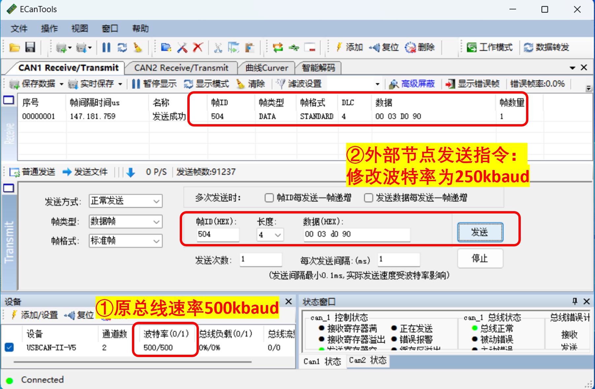
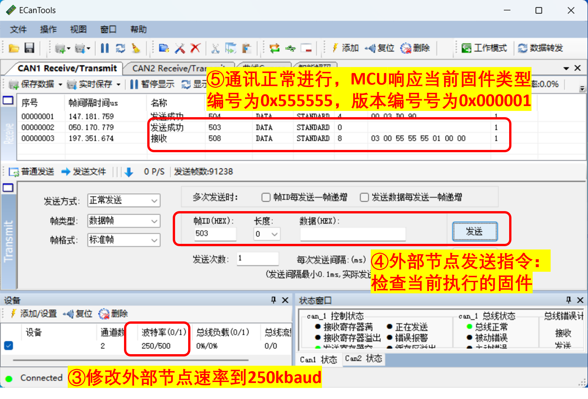
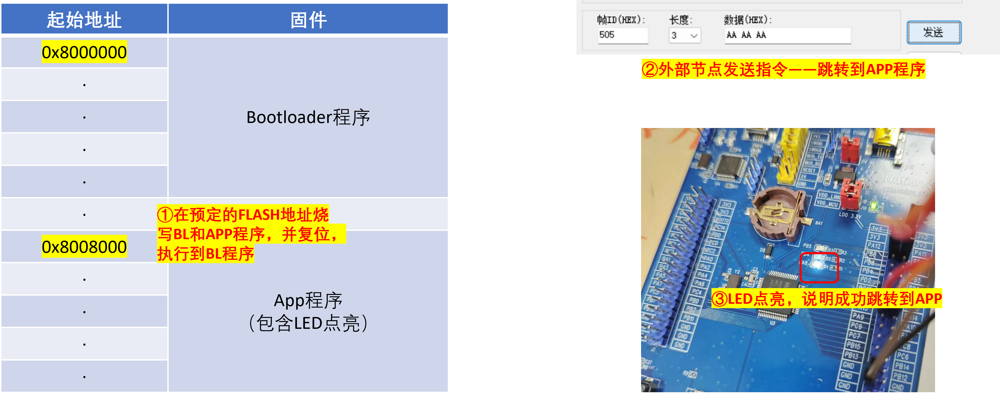

# IAP相关功能设计测试报告

## 1. 背景及理论
### 1.1 背景介绍

​	在汽车领域中，ECU 是车辆控制系统中的重要组成部分，控制着引擎、变速器、制动和电子稳定系统等关键功能。IAP（In-Application Programming）可以用于电子控制单元（ECU）的应用升级和固件更新。
​	通常情况下，ECU 设备上运行的软件被称为固件，这些固件需要经常更新以解决错误、添加新特性或提高性能。在过去，固件升级需要更换整个 ECU 设备或通过车辆回厂进行升级，这非常耗时和昂贵。而使用 IAP 技术，可以让车主通过无线网络或 USB 接口自己实现 ECUs 固件的升级。通过 IAP 实现 ECUs 固件升级具有以下几个优点：

* 提高安全性：ECU 升级将更容易地满足车辆设计的最新安全标准，使驾驶员和车辆得到更好的保护。
* 易于实现：通过 IAP 协议实现的车辆固件升级可实现即插即用，并且可以由 OEM 或其代理商，还可以由车主自行完成。
* 成本低廉：与传统的升级方式相比， IAP 技术不需要回收旧设备，也不需要更换整个 ECU 设备。这样不仅降低了车主的成本，同时也减少了车辆生产商和维修厂商的服务成本。
* 快速反应：IAP 技术可以快速响应市场需求，并支持随时随地进行固件更新和升级，保证最新特性和功能可在瞬间到达用户手中。

​	 IAP 在汽车 ECU 领域的应用具有重要意义。它为车辆电子控制系统中的软件升级和固件更新提供了实用方法和完善的技术保障，能够帮助车主、OEM 厂商以及维修厂商在快速、安全、低成本及便捷等方面获得显著优势。

### 1.2 理论介绍

​	下面着重介绍ECU的启动流程、如何切换到APP以及实现应用内编程的操作方式。

1. **ECU的启动流程**

​	当车辆点火后，ECU通常是第一个被激活的控制模块。ECU通过读取汽车传感器的数据、执行相应的算法和逻辑，来控制发动机的各个参数，实现车辆的正常运行。在开始工作之前，ECU需要完成以下几个步骤：

* 设备初始化：检查设备的状态，包括处理器芯片、RAM、ROM等。第一次上电时，ECU会进行自检和故障码清除，以确保设备正常工作。
- 检查电子元件：检查传感器和执行器电子部件的连接是否良好，例如，氧气传感器，油门位置传感器等。
- 检查应用程序：验证应用程序的完整性和可用性，若有问题则不会自动跳转到应用程序。
- 启动算法：ECU使用预先编写的算法确定引擎应该以怎样的方式启动，包括开启油泵、调整点火时间和喷油量等参数。

2. **如何切换到APP**

​	在应用可以正常工作的前提下，切换通常是自动的，实现取决于不同的策略。而在测试条件下，可以设置为手动切换，通常需要通过一些工具和软件，例如OBD（On-Board Diagnostic）扫描仪或者编程工具，并借助预定的通讯协议，如CAN、LIN等。下面是基本的步骤：

* 连接编程工具：使用专门的编程工具连接ECU，例如USB、CAN或J1939等。
* 打开编程程序：执行编程软件，并加载相关的ECU固件。
* 切换到IAP模式：在编程程序中，设置进入IAP模式的命令，使ECU进入IAP模式并允许修改内部固件。

3. **实现应用内编程的操作方式**

​	实现ECU应用内编程的关键在于ECU应用程序自身就能够识别和响应来自外部的编程请求。以下是基本步骤：

* 编写通讯协议：ECU并未提供标准化的操作方式，因此需要根据自身特点设计相应的协议规范。
* 加载应用程序：将应用程序加载到ECU中，以便修改或添加新功能。
* 修改或添加应用程序代码：在调试工具或编程工具的帮助下，对ECU应用程序进行修改或添加代码。
* 验证和调试：最后对ECU应用程序进行验证和调试，确保其满足预期的要求。

​	总之，ECU的启动流程、切换到APP以及实现应用内编程的操作方式都是涉及汽车ECU应用极其敏感和复杂的问题。

## 2. 协议的制定

​	通讯协议拟定为CAN通讯，数据链路层和物理层参考ISO 11898协议。上层协议自主设计。

### 2.1 ID格式

​	使用扩展数据帧，将节点地址和命令封装进CAN ID中，下面是CAN ID的格式。

|    保留     |  节点地址   |   命令    |
| :---------: | :---------: | :-------: |
| ID28...ID20 | ID19...ID14 | ID3...ID0 |

### 2.2 命令

​	协议中命令值范围为0x0~0xF，设计如下，未用到的值作为保留值：

|  **命令**   | **具体值** |                    **说明**                    |
| :---------: | :--------: | :--------------------------------------------: |
|    Erase    |    0x0     |            擦除APP程序存储区域数据             |
|  WriteInfo  |    0x1     |               发送连续写数据信息               |
|    Write    |    0x2     |                  发送APP数据                   |
|    Check    |    0x3     | 监测当前节点是否在线，并获取固件类型和版本信息 |
| SetBaudRate |    0x4     |                 设置节点波特率                 |
|   Excute    |    0x5     |             控制节点执行对应的固件             |
| CmdSuccess  |    0x8     |          执行命令成功，节点返回给主控          |
|  CmdFaild   |    0x9     |          执行命令失败，节点返回给主控          |

​	在IAP程序中要支持上述所有功能，在APP程序中，至少要支持Excute执行指令和Check固件检查指令
​	当指令成功执行后，服务器将返回一个命令段为0x8的数据帧，数据段Data[0]存放被执行的请求Cmd值，其他位采用默认填充，不包含任何信息；当指令执行失败后，服务器返回命令段为0x9的数据帧，且会在数据段返回错误代码，帮助调试和修复，错误代码的定义会在下方规定。

​	```注意：CmdSuccess和CmdFaild设为0x8/9目的为二进制下第四位为1，方便收发节点的底层筛选。```

#### 2.2.1 Erase 擦除指令

* 服务请求

​	擦除APP程序存储区域的数据。该命令带1个参数，也就是必须擦除的存储区域大小，单位为字节，一般可以设置为固件bin文件大小即可，占用CAN 4字节数据。起始地址由WriteInfo指令的AddrOffset信号传入，默认为预设APP起始地址。格式如下：

| 待擦除的存储区域大小FlashSize |                  |                   |                   |
| :---------------------------: | :--------------: | :---------------: | :---------------: |
|            Data[3]            |     Data[2]      |      Data[1]      |      Data[0]      |
|        FlashSize[7..0]        | FlashSize[15..8] | FlashSize[23..16] | FlashSize[31..24] |

* 失败响应

​	主节点发送该命令后，可以通过服务器返回的命令来判断该命令操作是否成功，若成功，则服务器返回CmdSuccess命令，若失败则返回CmdFaild命令，擦除操作一般比较耗时，建议在发送此命令之后尽量多等待一段时间。

|    Data[2]     |    Data[1]     |     Data[0]     |
| :------------: | :------------: | :-------------: |
| 默认填充0x5555 | FLASH_STS&0xFF | 被响应的请求Cmd |

#### 2.2.2 WriteInfo 写信息指令

* 服务请求

​	为了提高固件升级速度，我们采用发送一定量的固件数据之后才进行烧写，比如服务器接收到1024字节之后才将固件数据写入芯片内部的Flash中，所以在传输数据之前，应该先发送该命令，告诉服务器即将缓存的固件数据字节数，以及固件烧写的偏移地址，因此该命令带两个参数，固件数据偏移地址和服务器应该缓存的固件数据字节数。

| 固件数据地址偏移值AddrOffset                |                   |                    |                    |
| ------------------------------------------- | ----------------- | ------------------ | ------------------ |
| Data[3]                                     | Data[2]           | Data[1]            | Data[0]            |
| AddrOffset[7..0]                            | AddrOffset[15..8] | AddrOffset[23..16] | AddrOffset[31..24] |
| **服务器需要缓存的固件数据字节数DataNum  ** |                   |                    |                    |
| Data[7]                                     | Data[6]           | Data[5]            | Data[4]            |
| DataNum[7..0]                               | DataNum[15..8]    | DataNum[23..16]    | DataNum[31..24]    |

* 失败响应

​	程序数据缓存区大小是预设的固定值，因此指令仅在固件数据字节数超出这一限制时会返回执行失败。

#### 2.2.3 Write 写指令

* 服务请求

​	主节点向服务器连续发送固件数据，发送的总数据字节数为WriteInfo命令DataNum字节大小，由于CAN每帧数据最多只能带8字节数据，所以可以采用循环发送的方式连续发送大于8字节的数据，低地址位数据放入Data[0]，高地址位数据依次放入后面的7个数据区域，不满8字节数据也不用填充，剩余多少就发送多少即可。服务器通过计数判断是否完全接收固件程序，在没有完成的情况下，仅将数据缓存到数组中，等完成并验证后一次性写入到闪存。
​	当DataNum字节数据全部发送完毕之后，服务器应该判断数据的正确性，若数据正确则将数据写入芯片内部的程序存储区域，然后根据最终的状态向主节点返回本次烧写是成功还是失败，然后主节点根据服务器返回的状态值做进一步处理。
​	若本次操作没任何问题，则可以进行下一次的操作，依然是先发送WriteInfo命令，然后再根据固件数据字节数连续发送Write命令，直到所有固件数据全部发送完毕即可。

* 失败响应

​	执行失败的情况可能存在三个阶段中：数据传输阶段、数据验证阶段和数据写入阶段。

| 数据传输和验证阶段 |                 |             |
| :----------------: | :-------------: | :---------: |
|    Data[1] bit7    | Data[1] bit6..0 |   Data[0]   |
|         1          | 剩余数据量/128  | 被响应的Cmd |

| 数据写入阶段 |                                                              |                 |             |
| :----------: | :----------------------------------------------------------: | :-------------: | :---------: |
| Data[1] bit7 |                       Data[1] bit6..4                        | Data[1] bit3..0 |   Data[0]   |
|      0       | 001：数据校验失败<br />010：闪存工作状态值异常<br />100：成功标识写入失败 |  FLASH_STS&0xF  | 被响应的Cmd |

#### 2.2.4 Check 固件检查指令

* 服务请求

​	检测指定地址的节点工作是否正常，同时获取该节点的固件类型和固件版本信息，主节点发送该命令无需任何参数，从节点接收到该命令后，需要返回获取固件信息的状态命令，若是成功，则需要携带固件类型和固件版本两个参数。

| 固件版本Version  |              |              |              |
| ---------------- | ------------ | ------------ | ------------ |
| Data[3]          | Data[2]      | Data[1]      | Data[0]      |
| Minor[7..0]      | Minor[15..8] | Major[7..0]  | Major[15..8] |
| **固件类型Type** |              |              |              |
| Data[3]          | Data[2]      | Data[1]      | Data[0]      |
| Type[7..0]       | Type[15..8]  | Type[23..16] | Type[31..24] |

``注：Bootloader固件类型为：0x55555555；App固件类型为：0xAAAAAAAA。``


* 失败响应

​	无失败响应。

#### 2.2.4 SetBaudRate 设置波特率指令

* 服务请求

​	改节点波特率，该命令带一个参数，也就是从节点需要修改的波特率值，从节点更改完波特率值之后，会以新的波特率返回状态值，所以主控节点发送完毕该命令之后也应该尽快切换到新的波特率，若主控节点切换波特率没有从节点切换波特率快，则可以在从节点切换波特率之后加一个延时，否则可能会导致主节点接收不到从节点返回的状态命令。

| 新波特率值NewBaudRate |                    |                     |                     |
| --------------------- | ------------------ | ------------------- | ------------------- |
| Data[3]               | Data[2]            | Data[1]             | Data[0]             |
| NewBaudRate[7..0]     | NewBaudRate[15..8] | NewBaudRate[23..16] | NewBaudRate[31..24] |

* 失败响应

|    Data[2]     |               Data[1]                |     Data[0]     |
| :------------: | :----------------------------------: | :-------------: |
| 默认填充0x5555 | 0x01：输入不支持<br />0x02：硬件错误 | 被响应的请求Cmd |

#### 2.2.5 Excute 执行固件指令

* 服务请求

​	执行指定类型的固件，该命令带一个参数，也就是固件类型，若当前节点的固件类型是App，那么该从节点收到此命令后应立即跳转执行Bootloader程序，反之亦然。
​	该命令没有成功状态返回，可以通过执行Check命令来获取固件类型，以此判断固件是否执行成功。

* 失败响应

​	无失败响应。

## 3. 功能的实现

### 3.1 CAN报文收发和解析

​	CAN报文收发遵循先缓存后处理的原则，基本过程与CAN收发程序相同——即在报文接收中断中将外设接收FIFO中的报文数据复制到接收缓存列表，并将接收标志置位。主程序循环中会进行标志位检测，当检测到有报文接收，开始进行命令及参数提取、命令执行并返回执行结果、执行结果发送流程。
​	定义新的命令信息结构体类型BootCMDInfo，用于定义接收到的命令和执行的结果。

```BootCMDInfo结构体类型
/* Bootloader命令信息结构体*/
typedef struct{
	BL_CMD	Bootcmd;
	uint8_t		DLC;
	uint8_t		Cmdinfo[8];
}BootCMDInfo;

extern BootCMDInfo	Bootcmdinfo;//接收命令变量
extern BootCMDInfo	Bootcmdres; //命令执行结果
```

### 3.2 SetBaudRate指令实现

​	指令的输入参数只有32位无符号整型的以Baud为单位的波特率数值，范围是从0~1000000，但只有有限的典型值被支持，因此需要首先判定是否支持对应的波特率，即构建索引函数，为所有支持的波特率返回一个索引值，若不支持，则返回0xFF。指令执行结果返回“输入不支持”错误码0x01。
​	若支持该输入波特率值，则进行相应波特率修改流程。依据CAN控制器外设要求，通过MCTRL寄存器设置控制器为初始化模式并等待状态转换完成后，将预设的SJW、BS1、BS2和PreScale参数写入BTIM寄存器，再重新设置为正常模式。等待过程通过循环减计数的方式计时，若超时，则指令执行结果返回“硬件错误”指令。

### 3.3 WriteInfo指令实现

​	指令输入的固件数据字节数超限会导致指令执行失败，其他情况仅进行数据记录。

### 3.4 Write指令实现

​	Write指令要接收固件数据信息，要占用多个主程序循环周期，通过静态变量对当前接收到的数据量进行计数。在未接收完所有数据之前，会将所有数据缓存起来。数据接收量达到预定值后，进行Flash编程。
​	依据FLASH的编程规则，在进行编程前先要将原本的数据擦除并解锁，编程完成后要锁定FLASH，防止误操作。通过循环写入，每次写入4Byte数据，实现写入整个固件数据。每次字写入都会返回FLASH状态，若出现FLASH错误，则终止执行，并返回错误码。
​	若固件数据的FLASH写入没有出现错误，则进行APP程序可用标志写入，即在FLASH特定位置写入预设编码，以在ECU复位后可以判断APP固件是否可用。同样在标志写入也可能出现FLASH错误，同样会返回错误码。这些程序顺利完成后，最终返回成功执行的结果。

### 3.5 Check指令实现

​	当接收到检查当前固件的指令，程序会将当前的固件类型码和固件版本码编码进待发送CAN数据帧的数据域并发送。

### 3.6 Excute指令实现

​	收到指令后，解析出固件类型码，需要验证相应的固件起始地址内的值是否为0xFF，即验证其已经编程。若通过，则进入跳转程序，跳转程序首先进一步验证固件数据首个字的值，通过后，将目标固件地址定义为函数类型地址。从固件首地址中取出主堆栈指针地址，对堆栈寄存器进行赋值。然后执行函数，进行程序跳转。
​	若其中任意一步验证失败，则返回执行结果为执行失败；若外部节点没有收到响应报文，则默认成功，可以通过Check指令验证。

```
typedef  void (*pFunction)(void);
/**
  * @brief  控制程序跳转到指定位置开始执行 。
  * @param  Addr 程序执行地址。
  * @retval 程序跳转状态。
  */
void BOOT_JumpToApplication(uint32_t Addr)
{
  static pFunction Jump_To_Application;
  __IO uint32_t JumpAddress; 
  /* Test if user code is programmed starting from address "ApplicationAddress" */
  if (((*(__IO uint32_t*)Addr) & 0x2FFE0000 ) == 0x20000000)
  {
    /* Jump to user application */
    JumpAddress = *(__IO uint32_t*) (Addr + 4);
    Jump_To_Application = (pFunction) JumpAddress;
    __set_PRIMASK(1);//关闭所有中断
    /* Initialize user application's Stack Pointer */
    __set_MSP(*(__IO uint32_t*)Addr);
    Jump_To_Application();
  }
}
```

## 4. 测试过程及结果

### 4.1 SetBaudrate、Check指令测试

**[测试目的]**
验证DUT能否正常执行波特率设置程序。
SUB CASE 1：上位机模拟节点和DUT节点设置500kBaud建立通讯，上位机节点发送指令让DUT设置波特率为250kBaud，观察DUT的响应。
SUB CASE 2：上位机模拟节点切换波特率到250kBaud，发送固件检查指令，观察DUT的响应。

**[验收准则]**
DUT能够完成波特率切换并正常工作。

**[测试记录]**
SUB CASE 1：



SUB CASE 2：



​	测试通过。

### 4.2 WriteInfo、Write、Excute指令测试

**[测试目的]**
验证DUT能否正常执行FLASH编程。
CASE：上位机模拟节点和DUT节点设置500kBaud建立通讯，上位机节点WriteInfo指令并通过Write指令传递固件数据（包含点亮LED灯程序），而后发送固件执行指令，使程序执行到刚刷写的固件，观察DUT的响应。

**[验收准则]**
DUT成功点亮LED，说明程序烧写并跳转成功。

**[测试记录]**
CASE：



​	测试通过。
