# MCU外设学习_ADC

2023年7月4日

---

* **模数转换的基本原理和过程**

> ​	由模拟信号转化为数字信号，需要经过采样-量化-编码三个步骤。采样即将待测信号以一定的频率（采样频率）进行采集，量化即将电平值分成若干等级（可分的等级数量即分辨率/量化间隔，n位分辨率即2^n个量化间隔），将量化等级转化为数字编码。

* **模数转换器的类型**

> 1. *Flash ADC*
>
> 由使能端、串联电阻接口、比较器、D锁存器和编码器共同组成。
>
> 优点是转化速率高，用时短；
>
> 缺点是分辨率低，功耗大。
>
> 若要提高精度，D锁存器和后端编码器的数量也呈指数级上升（2^n），造成芯片体积、功耗的问题。
>
> 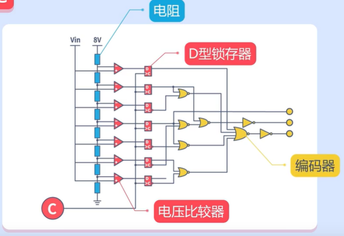
>
> 2. *流水线型ADC*
>
> 
>
> 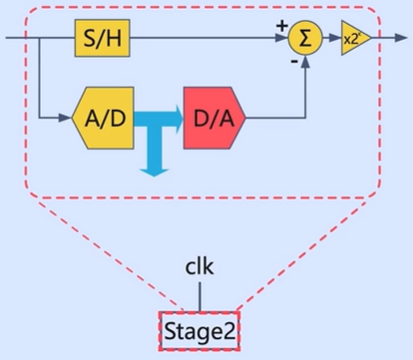
>
> 来自上一级的输出信号进入下级Stage后，首先进行A/D转换，精度为1bit，再进行一次D/A转换，将原信号与转换后的信号作差后乘以2，再传递至下一级。
>
> 扩展成本低，每增加1bit分辨率只需要增加一级Stage，适合高分辨率的情况。
>
> 优点是采样速度快、功耗低；缺点是工艺复杂、电路要求高。
>
> 3. *逐次逼近型ADC*
>
> 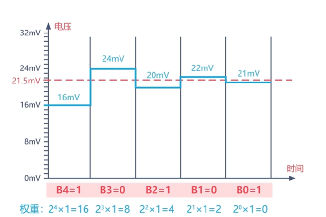
>
> 过程上，每次都用源信号（待测信号）与权重相比较得到本位的结果，权重由之前的比较结果得出。
>
> 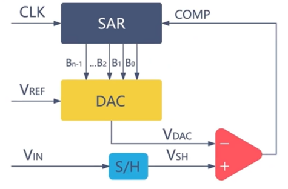
>
> 电路架构上，由逐次逼近寄存器（SAR）、DAC、减法器组成。
>
> 优点：节省资源，提高分辨率，功耗低、中高转换速度和精度；
>
> 缺点：设计复杂、生产成本高。
>
> 4. Σ-Δ（Sigma Delta） ADC
>
> 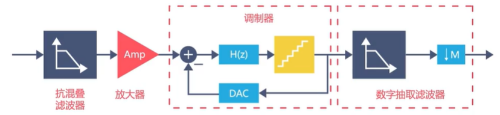
>
> 优点：分辨率高达24bit，易于集成；
>
> 缺点：响应时间长，功耗高。

* **采样率和采样频率的概念差别**

> ​	数值上和意义上应当是相近的，但采样率表示固定周期内的采样次数，必须是整数；采样频率没有这个限制。

* **采样率的选择（与原始信号的频域关系）**

> 在不进行任何算法的情况下，至少要10倍频率的采样率进行采样。在要求还原频谱的情况下，则采样频率必须大于2倍原始信号的频率。
>
> 如果想用较低的采样率实现较好的采样效果，可以使用傅里叶插值的方式。
>
> 同步采集卡是各通道同时采样，异步采集卡是单ADC芯片的多通道轮询式采样。

* **关于国民技术芯片模数转换器的基本情况**

> 1. 使用12 位 ADC 是使用<u>逐次逼近</u>的高速模数转换器。
>
> 2. 19 个通道，可测量 16 个外部和 3 个内部信号源。
>
> 3. 每个通道的 A/D 转换有四种执行模式：单次、连续、扫描或间断。
>
> 4. ADC 转换值存储（左对齐/右对齐）在 16 位数据寄存器中。
>
> 5. 支持 12 位、10 位、8 位、6 位分辨率。
>     12bit 分辨率下最高采样速率 5.14MSPS。
>     10bit 分辨率下最高采样速率 6MSPS。
>     8bit 分辨率下最高采样速率 7.2MSPS。
>     6bit 分辨率下最高采样速率 9MSPS。
>
>    注：最高采样率在 Fast Channel 下测得
>
> 6. ADC 时钟源分为工作时钟源、采样时钟源和计时时钟源。
>     仅可配置 AHB_CLK 作为工作时钟源。
>     可配置 PLL 作为采样时钟源，最高可到 72MHz，支持1,2,4,6,8,10,12,16,32,64,128,256分频 。
>     可配置 AHB_CLK 作为采样时钟源，最高可到 72MHz，支持分频 1,2,4,6,8,10,12,16,32。
>     计时时钟用于内部计时功能，频率必须配置成 1MHz。
>
> 【猜测】：工作时钟源就是所有外设必要的时钟，关系着每一步的信号传递和处理动作的同步；采样时钟源即触发采样的时钟；计时时钟是类似与实时时钟RTC，必须是每ms1个tick。
>
> 7. 支持触发采样，包括 EXTI/**TIMER**。【电控程序应该对采样的时序有要求】
> 8. 各通道的采样时间间隔可编程。
> 9. 支持扫描模式、单次转换、连续转换、间断模式、自校准。
> 10. 支持 DMA、 中断生成。
> 11. 带内嵌数据一致性的数据对齐。
> 12. 可以外部触发注入转换和规则转换。
> 13. ADC 的工作电压在 1.8V 到 3.6V 之间。ADC 支持转换的电压在 V REF- 和 V REF+ 之间。

2023年7月5日

---

- **ADC框图**

> 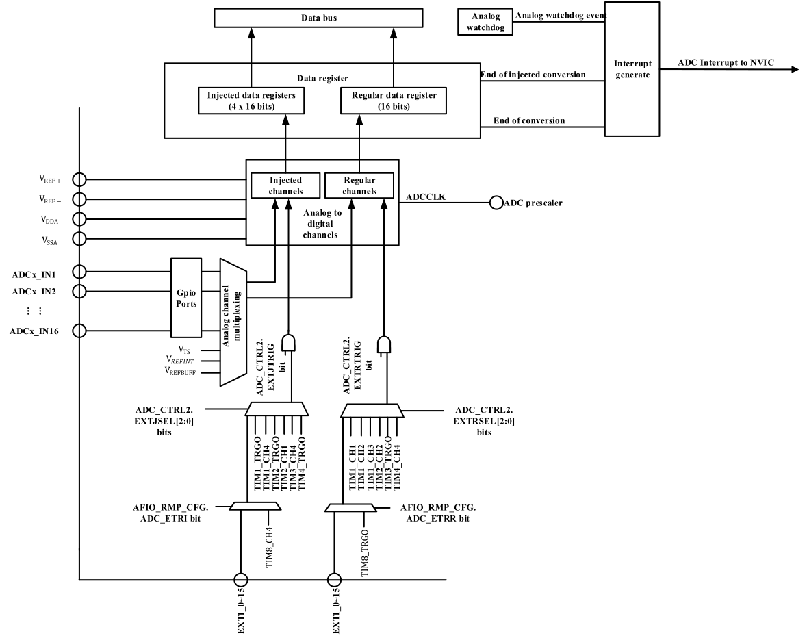
> V REF+ 输入，模拟参考正极 ADC使用的高端/正极参考电压，1.8V ≤ V REF+ ≤ V DDA
> V DDA 输入，模拟电源 等效于V DD 的模拟电源且：1.8V ≤ V DDA ≤ V DD (3.6V)
> V REF- 输入，模拟参考负极 ADC使用的低端/负极参考电压，V REF- = V SSA
> V SSA 输入，模拟电源地 等效于VSS的模拟电源地
> ADC_IN[16:1] 模拟输入信号 16个模拟外部输入通道
>
> 注意： VDDA 和 VSSA 应该分别连接到 VDD 和 VSS 。

- **关于ADC的通道**

> 每个通道可以配置为规则序列和注入序列。
> 注入序列由**多次转换**组成，最多 4 次。ADC_JSEQ 寄存器指定注入通道和注入通道的转换顺序。ADC_JSEQ.JLEN[1:0]位指定注入序列长度。
> 规则序列由多次转换组成，最多 16 次。ADC_RSEQx 寄存器指定规则通道和规则通道的转换顺序。ADC_RSEQ1.LEN[3:0]位指定规则通道序列长度。
>
> 【推测】基本理论应该是这样的，配置各个通道并且使能，即每个通道连接特定的外部引脚或者内部输入，配置好[序列]也就是ADC的扫描顺序，ADC会依照配置（其他比如采集次数等）扫描输入，把结果存到寄存器。所以这里讲序列由多次转换组成。<u>问题是注入转换不应该是触发转换吗？如果也和规则通道一样，那两者的区别何在？</u>
>
> <u>左侧的正方形的输入图标代表什么?</u>
>
> <u>难道不是一个单线信号?为什么还能分成两路N/P?</u>
>
> <u>后边Vinp和Vinn的连接也画错了吧,短接怎么用?</u>
>
> 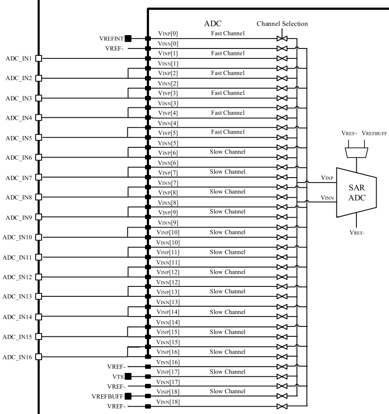

* **关于ADC的开关控制**

> 即如何开启和关闭，这里用到了寄存器状态位来指示上电状态，应该是有一个上电动作时间。关闭（这里的关闭应该是指转换功能关闭Disable，并不是掉电了）有两种状态，一是PowerDown，会保持校正值；另一个是深度睡眠模式，不保持校正值，进一步降低功耗。
>
> <u>什么是校正值？</u>
>
> 【注意】ADC_CTRL2.ON 首次设置为 1 时，ADC 上电。ADC 上电后，ADC 需要时间 t STAB 来保证其稳定性。ADC稳定后，再次对 ADC_CTRL2.ON 写 1，ADC 开始转换，转换结束标志位将在转换完成后设置为 1。
>
> 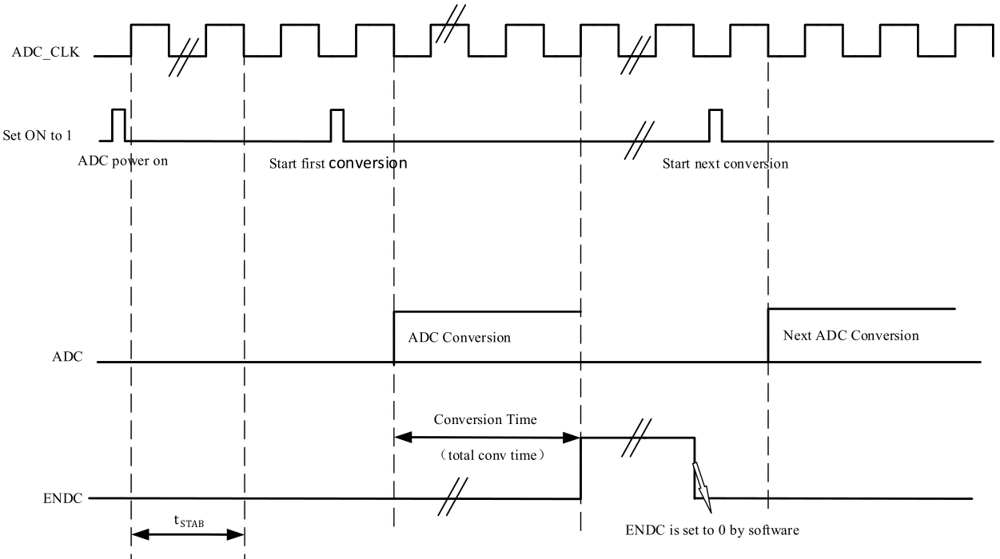

* **转换模式——单次和连续**

> 注入通道不支持连续转换。
>
> 配置 **ADC_CTRL2.CTU **为 0 进入单次转换模式，为 1 进入连续转换模式。外部触发（适用于规则或注入通道）或设置 ADC_CTRL2.ON=1（仅适用于规则通道）可以启动 ADC 启动转换，区别是转换一次（一个序列转换）就停止还是循环多次。
>
> 一个注入/规则通道（一次转换，并不是一个序列转换）转换完成后，置位结束标志（ADC_STS.JENDC/ADC_STS.ENDC），将转换后的数据存储在寄存器（ ADC_JDATx/ADC_DAT），配置时可将中断使能位（ADC_CTRL1.JENDCIEN/ADC_CTRL1.ENDCIEN）置1，会产生中断。
>
> <u>规则通道也能通过外部触发进行转换了，那还要注入通道干什么？？</u>【注入通道的转换相对规则通道有抢占优先级】

* **关于ADC附带的模拟看门狗的作用**

> ADC外设附属的看门狗用于监控和保护ADC模块的正常运行。它可以检测异常情况并进行复位操作，确保系统稳定性和数据准确性。
>
> 异常保护：看门狗能够监测到ADC外设在处理过程中可能出现的错误、死锁或响应不良等异常情况。例如，在读取模拟信号时，如果ADC出现故障或未能按预期完成转换，看门狗可以通过检测到的异常信号来触发复位，防止错误数据被继续使用。

* **关于扫描模式**

> 通过配置 ADC_CTRL1.SCAMD 为 1 可以开启扫描转换模式，通过配置四个寄存器 ADC_RSEQ1、ADC_RSEQ2、ADC_RSEQ3、ADC_JSEQ 可以选择转换通道序列，ADC 会对所有选择的规则或注入通道进行扫描转换。转换开始后，通道将一个一个转换。如果此时 ADC_CTRL2.CTU 为 1，则在所有选中的规则通道的转换完成后，将从转换序列的第一个通道重新开始转换。注入通道不支持连续转换。DMA 功能可以通过设置 ADC_CTRL2.ENDMA 为 1 来开启，DMA 会在规则通道转换完成后将数据传输到 SRAM 中。注入通道转换的数据总是存储在 ADC_JDATx 寄存器中。
>
> <u>扫描模式跟连续转换模式差在哪啊？？</u>

* **关于注入通道管理**

> 1.自动注入
>
> 如果设置了 ADC_CTRL1.AUTOJC 位，则 ADC_JSEQx 选择的注入通道将在 ADC_RSEQx 选中的规则通道转换完成后自动转换。最多可以转换多达 16+4 个通道。设置 ADC_CTRL2.CTU 转换序列将被连续转换。
> 开启该功能时，需要关闭注入通道的外部触发。此功能不能与间断模式同时使用。
> 当 ADC 时钟预分频因子为 2 时，当转换序列从规则变为注入或注入变为规则时，会有 2 个 ADC 时钟间隔的延迟。当 ADC 时钟预分频因子为 4 到 8 时，当转换序列从规则变为注入或注入变为规则时，会有 1 个ADC 时钟间隔的延迟。
>
> 2.触发输入
>
> xxxxxxxxxx ​ /*---------- TIM5 configuration: Output PWM mode ------ */    //配置PWM生成器TIM5    TIM_TimeBaseStructure.Period    = PWMPERIOD - 1; TIM_TimeBaseStructure.Prescaler = PWMPRESCALER - 1; TIM_TimeBaseStructure.ClkDiv    = 0; TIM_TimeBaseStructure.CntMode   = TIM_CNT_MODE_UP;    TIM_InitTimeBase(TIM5, &TIM_TimeBaseStructure);    TIM_OCInitStructure.OcMode      = TIM_OCMODE_PWM1; TIM_OCInitStructure.OutputState = TIM_OUTPUT_STATE_ENABLE; TIM_OCInitStructure.Pulse       = PWMCOMPARE; TIM_OCInitStructure.OcPolarity  = TIM_OC_POLARITY_HIGH; TIM_InitOc1(TIM5, &TIM_OCInitStructure);​ /* ------TIM3 configuration: Input Capture mode --------- */    //配置捕获时钟源TIM3    TIM_TimeBaseStructure.Period    = CAPTUREPERIOD - 1; TIM_TimeBaseStructure.Prescaler = CAPTUREPPRESCALER - 1; TIM_TimeBaseStructure.ClkDiv    = 0; TIM_TimeBaseStructure.CntMode   = TIM_CNT_MODE_UP; TIM_InitTimeBase(TIM3, &TIM_TimeBaseStructure); //CC1和CC2通道均映射为TI1输入，分别设置上升/下降沿捕获 TIM_ICInitStructure.Channel     = TIM_CH_1; TIM_ICInitStructure.IcPolarity  = TIM_IC_POLARITY_RISING; TIM_ICInitStructure.IcSelection = TIM_IC_SELECTION_DIRECTTI; TIM_ICInitStructure.IcPrescaler = TIM_IC_PSC_DIV1; TIM_ICInitStructure.IcFilter    = 0x0; TIM_ICInit(TIM3, &TIM_ICInitStructure);​    TIM_ICInitStructure.Channel     = TIM_CH_2; TIM_ICInitStructure.IcPolarity  = TIM_IC_POLARITY_FALLING; TIM_ICInitStructure.IcSelection = TIM_IC_SELECTION_INDIRECTTI;    TIM_ICInit(TIM3, &TIM_ICInitStructure);    //设置触发输入源为TI1FP1，而且涉及SMSEL[2:0]从模式选择（Slave mode selection）设为000：关闭从模式    TIM_SelectInputTrig(TIM3, TIM_TRIG_SEL_TI1FP1);    //设置SMSEL[2:0]从模式选择（Slave mode selection）设为100：复位模式–选中的触发输入（TRGI）的上升沿    TIM_SelectSlaveMode(TIM3, TIM_SLAVE_MODE_RESET);​ /* TIM enable counter */ TIM_Enable(TIM3, ENABLE);      TIM_Enable(TIM5, ENABLE); /* Enable the CC2 Interrupt Request */ TIM_ConfigInt(TIM3, TIM_INT_CC1 | TIM_INT_CC2, ENABLE);配置详情

* **关于间断模式**

> 1.规则通道【每次触发一个序列的一次转换】
>
> 配置 ADC_CTRL1.DREGCH 为 1，开启规则通道的间断模式，通过配置 ADC_RSEQ1、ADC_RSEQ2、ADC_RSEQ3 获取规则转换序列，配置 ADC_CTRL1.DCTU[2:0]控制每次触发后转换 n 个通道。当触发信号产生时，对规则序列的 n 个通道进行转换然后停止，直到下一个触发信号产生，从上一次转换停止的地方开始继续转换 n 个通道，直到规则序列的所有通道被转换（如果最后一个触发发生并且转换序列中的剩余通道小于 n，则只转换剩余未转换的通道并停止转换），并且转换结束标志位也将被设置为 1.当转换序列中所有通道的转换完成后，下一个触发信号出现时，再次从规则序列的第一个通道开始转换。
>
> 2.注入通道【每次触发单通道转换，依照序列循环顺序，每次转换都换一个通道】
>
> 配置ADC_CTRL1.DJCH为 1，开启注入通道的间断模式，通过配置 ADC_JSEQ 获取注入转换序列。
> 当触发信号产生时，它将转换注入转换序列的 1 个通道，然后停止。直到下一个触发信号产生，它会从上一次转换停止的通道处继续转换 1 个通道，直到注入序列的所有通道都被转换，并且转换结束标志位也将设置为 1。当转换序列中所有通道的转换完成时，下一个触发信号出现时，再次从注入序列的第一个通道开始转换。
> 同时间只能设置规则转换和注入转换其中一种为间断模式，不能同时设置自动注入模式和间断模式。

* **关于校准**

> 为了减少误差，ADC 具有内置的自校准机制。在 A/D 转换之前，计算每个电容器的误差修正值。该值用于消除转换期间内部电容器组引起的误差。将 ADC_CTRL2.ENCAL 位设置为 1 以启动自校准。在校准过程中，ADC_CTRL2.ENCAL 位保持为 1。校准后，ADC_CTRL2.ENCAL 位由硬件复位，然后可以开始 A/D 转换。校准阶段结束后，校准码储存在 ADC_DAT 中。
>
> 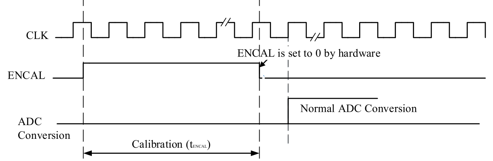

* **数据对齐**

> 转换后的数据有两种对齐方式：左对齐和右对齐。对齐可以通过 ADC_CTRL2.ALIG 位设置。ADC_CTRL2.ALIG=0 为右对齐，如表 所示，ADC_CTRL2.ALIG=1 为左对齐，如表 所示。
> 对于注入序列，SYM 位是扩展的符号值(Symbol)，**寄存器中存储的数据是转换结果减去 ADC_JOFFSETx 寄存器中用户定义的偏移量，所以结果可以是负值**【也就是说，只有注入序列才能定义偏移量】；对于规则序列，不需要减去偏移值。
>
> 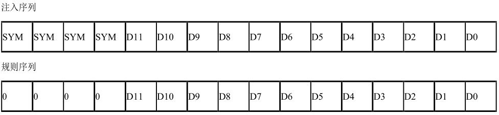
>
> 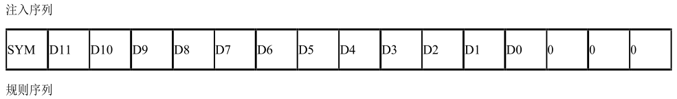
>
> 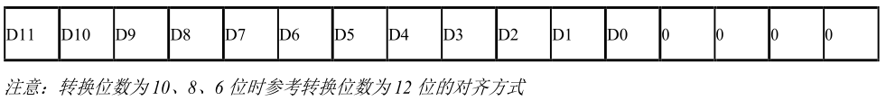

* **关于通道采样时间编程**

> ADC 使用若干个 ADC_CLK 周期对输入电压采样，采样周期数目可以通过 ADC_SAMPTx.SAMPx[2:0]设置。每个通道可以分别用不同的时间采样。总转换周期数Tconv = 采样时间（寄存器设置）+ 12.5。
> 例如：当 ADCCLK=72MHz，12bit 分辨率下设置采样时间为 1.5 周期，Tconv = 1.5 + 12.5 = 14 周期 = 0.1944μs。

* **关于外部触发转换**

> 

2023年7月6日

---

* **关于ADC中的状态寄存器ADC_STS**

> 开始状态标志（STR/JSTR），即规则通道序列/注入通道序列开始转换时硬件置1；
>
> 任意单通道转换完成状态标志（ENDC/JENDC），即有一规则或注入/注入通道转换完成时硬件置1；
>
> 序列转换完成状态标志（ENDC/JENDC），即规则和注入/注入通道序列全部转换完成时硬件置1。
>
> 模拟看门狗状态标志，好像是监控输入的模拟电压范围有没有超限。

* **关于ADC控制寄存器ADC_CTRL1/2/3**

> 1. *CTRL1*
>
> |    Bits     |                           Fouction                           |
> | :---------: | :----------------------------------------------------------: |
> | AWDGCH[4:0] | 选择模拟看门狗（Analog Watchdog channel select）保护的输入通道，AWDGSGLEN =1时才有效 |
> |   ENDCIEN   |              ENDC（End of Conversion）中断使能               |
> |   AWDGIEN   |    模拟看门狗中断使能（Analog watchdog interrupt enable）    |
> |  JENDCIEN   | 注入通道的中断使能（Interrupt enable for injected channels） |
> |   SCANMD    | 扫描模式 （Scan mode）使能位。在扫描模式下，转换由ADC_RSEQx或ADC_JSEQ 寄存器选定的通道 |
> |  AWDGSGLEN  |            扫描模式中在单一/所有通道上使用看门狗             |
> |   AUTOJC    |    开启或关闭规则通道序列转换结束后自动的注入通道序列转换    |
> |   DREGCH    |               开启或关闭在规则通道上的间断模式               |
> |    DJCH     |               开启或关闭在注入通道上的间断模式               |
> |  DCTU[2:0]  | 间断模式通道计数。定义在间断模式下，收到外部触发后转换规则通道的数目 |
> |  AWDGEJCH   |               在注入通道上开启/关闭模拟看门狗                |
> |  AWDGERCH   |               在规则通道上开启/关闭模拟看门狗                |
>
> 注意：如果单独设置 ADC_CTRL1.ENDCIEN 或 ADC_CTRL1.JENDCIEN 位，ADC_STS.ENDC 或 ADC_STS.JENDC 中断仅在最后一个通道转换后发生。
>
> 2. *CTRL2*
>
> |     Bits     |                           Fouction                           |
> | :----------: | :----------------------------------------------------------: |
> |      ON      | A/D 转换器开/关.当该位为“0”时，写入“1”会将ADC从断电模式中唤醒。当该位为“1”时，写入“1”开始转换。应注意，转换器上电与转换开始之间存在延迟tSTAB |
> |     CTU      |    连续转换。如果该位置位，则转换将继续，直到该位被清除。    |
> |    ENCAL     | A/D校准（A/D Calibration）。由软件设置以开始校准，并在校准结束时由硬件清零。 |
> |    ENDMA     |               使用/不使用直接存储器访问模式。                |
> |     ALIG     |                    数据对齐。左/右对齐。                     |
> | EXTJSEL[2:0] |             选择启动注入通道序列转换的外部事件。             |
> |   EXTJTRIG   |           不使用/使用注入通道的外部触发转换模式。            |
> | EXTRSEL[2:0] |             选择启动规则通道序列转换的外部事件。             |
> |   EXTRTRIG   |            不使用/使用规则通道的外触发转换模式。             |
> |   SWSTRJCH   | 开始转换注入通道。软件设置以启动转换，并且可以在转换开始后立即由软件或硬件清零。 |
> |   SWSTRRCH   |                      开始转换规则通道。                      |
> |    TEMPEN    |                 温度传感器和V REFINT 开启。                  |
>
> 3. *CTRL3*
>
> |   Bits    |                           Function                           |
> | :-------: | :----------------------------------------------------------: |
> | RES[1:0]  |                         数据分辨率。                         |
> |  CALDIF   |        差分模式校准，以配置校准的单端/差分输入模式。         |
> |  CALALD   |                        校准自动载入。                        |
> |   CKMOD   |      时钟模式。0: 同步时钟选择AHB；1：异步时钟选择PLL。      |
> |    RDY    |                     ADC准备好/未准备好。                     |
> |   PDRDY   |                    ADC掉电准备/未准备好。                    |
> |   BPCAL   |                          旁路校准。                          |
> | ENDCAIEN  |               启用/禁用任意通道转换结束中断。                |
> | JENDCAIEN |               启用/禁用注入通道转换结束中断。                |
> |  DPWMOD   | 深度低功耗模式。ADC 禁用时，ADC 进入低功耗模式/深度低功耗模式。 |

* **关于采集时间寄存器ADC_SAMPTx【物理通道的属性】**

> ADC_SAMPT3.SAMPSEL位定义了采样时间映射表的选择，0/1会选择不同的映射表。
>
> 其他的所有有效的位域都是SAMPx[2:0]（x=0..18)，依据SAMPSEL位定义的映射表，选择采样时间周期。

* **关于规则/注入序列寄存器ADC_RSEQx/ADC_JSEQ【转换序列表的属性】**

> ADC_RSEQ1.LEN[3:0]定义了规则序列长度（序列中的通道数）。
>
> 其他的位域都是SEQx[4:0]（x=1..16），定义转换序列中第x个转换通道的编号（0到18）。**将序列的顺序表跟通道编号做映射。**
>
> ADC_JSEQ.JLEN[1:0]定义注入通道序列长度。
>
> JSEQx[4:0]由软件定义为转换序列中第4个转换通道的编号（0到18）。
>
> <u>注意：与规则转换序列不同，如果ADC_JSEQ.JLEN[1:0]的长度小于4，则转换序列从(4-JLEN)开始。例如，ADC_JSEQ[21:0] = 10 00011 00011 00111 00010 表示扫描转换将按照以下通道顺序进行转换：7、3、3 而不是 2、7、3。</u>【这里JLEN=2，即序列长度为3，对4个序列号的定义为1-2，2-7，3-3，4-3，实际选择的序列是定义中的第2.3.4号，这是个类似于对齐的问题。】

* **关于ADC其他的寄存器**

> |                      Register                       |                           Function                           |
> | :-------------------------------------------------: | :----------------------------------------------------------: |
> | ADC 注入通道数据偏移寄存器 x (ADC_JOFFSETx)(x=1..4) | 定义注入通道x的数据偏移.将转换注入通道时用于从原始转换数据中减去的值。转换结果可以在ADC_JDATx寄存器中读取。 |
> |        ADC 看门狗高阈值寄存器 (ADC_WDGHIGH)         |            这些位定义模拟看门狗的高阈值（上限）。            |
> |         ADC 看门狗低阈值寄存器 (ADC_WDGLOW)         |            这些位定义模拟看门狗的低阈值（下限）。            |
> |            ADC 规则数据寄存器 (ADC_DAT)             | 这些位是只读的，包含规则通道的转换结果。数据左对齐或右对齐。 |
> |      ADC 注入数据寄存器 x (ADC_JDATx) (x= 1…4)      | 这些位是只读的，包含注入通道的转换结果。数据左对齐或右对齐。 |
> |       ADC 择 差分模式选择 寄存器 (ADC_DIFSEL)       | 差分模式通道18—1选择(Differential mode for channels 18 to 1)。 DIFSEL[i] = 0/1:ADC 通道输入i+1配置成单端模式/差分模式。 |
> |             ADC 校正因子 (ADC_CALFACT)              |       定义差分/单端模式校正因子。可由硬件或软件写入。        |

