# MCU外设学习_定时器

<center>2023年06月30日</center>（这一天参考的都是stm32f4处理器 ）

---

> ​	把定时器的结构分成4个部分——时钟源、时基电路、输入捕获电路和输出比较电路就能很好的理解。

> 


* **关于计数器使能位CEN**

> ​	只有事先通过软件将CEN位置1，才能使用<u>外部时钟、门控模式和编码器模式</u>；触发模式可以通过硬件自动将CEN位置1；单脉冲模式下，发生更新事件会自动将CEN位清零。

* **关于计数器的时钟源**

> 定时器架构图的整个上半部分都是时钟源选择和产生CK_PSC。定时器的时钟来源有 4 个：
> 1）内部时钟（CK_INT）——APB1产生的外设时钟。
> 2）外部时钟模式 1：外部输入脚（TIx）——定时器的输入捕获通道引入。
> 3）外部时钟模式 2：外部触发输入（ETR），仅适用于 TIM2、TIM3、TIM4。数据手册中可以查到，可以复用到哪些引脚。
> 4）内部触发输入（ITRx）：——定时器级联。由上级定时器的TRGO信号输入。

> 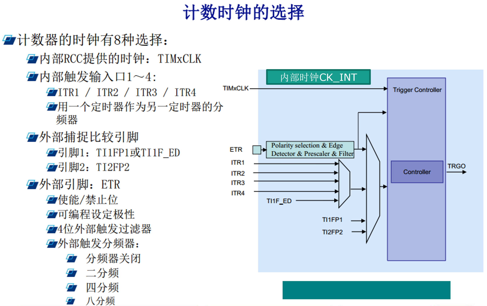

> 这里的内部时钟就是CK_INT（internal）。

* **关于PWM输出——输出比较模式**

> ​	假定定时器工作在向上计数 PWM模式，且当 CNT<CCRx 时，输出 0，当 CNT>=CCRx 时输出 1。那么就可以得到如上的 PWM示意图：当 CNT 值小于 CCRx 的时候，IO 输出低电平(0)，当 CNT 值大于等于 CCRx 的时候，IO 输出高电平(1)，当 CNT 达到 ARR 值的时候，重新归零，然后重新向上计数，依次循环。改变 CCRx 的值，就可以改变 PWM 输出的占空比，改变 ARR 的值，就可以改变 PWM 输出的频率。

> 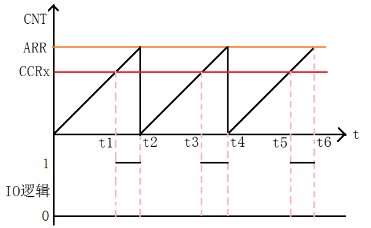

* **关于捕获/比较的寄存器**

> ​	3个寄存器——捕获/比较模式寄存器（TIMx_CCMR1/2）、捕获/比较使能寄存器（TIMx_CCER）、捕获/比较寄存器（TIMx_CCR1~4）。

<center>2023年7月1日</center>

---

- **关于外部时钟源模式1（TIx）**【2023年7月3日有补充】

> ​	当 TIMx_SMCR 寄存器中的 SMS=111 时，可选择此模式。计数器可在选定的输入信号上出现上升沿或下降沿时计数。
>
> 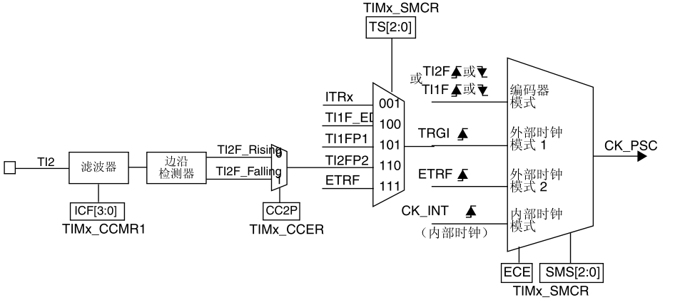
>
> 配置要素，假如<u>要使递增计数器在 TI2 输入出现上升沿时计数（使用CC2通道）</u>：
>
> 1. 通过在 TIMx_SMCR 寄存器中写入 SMS=111且ECE=0（复位值）选择外部时钟模式1即TRGI作为CK_PSC的源。
> 2. 通过在 TIMx_SMCR 寄存器中写入 TS=110 来选择 TI2 作为输入源。
> 3. 通过在 TIMx_CCER 寄存器中写入 CC2P=0 和 CC2NP=0 来选择上升沿极性。
> 4. 通过在 TIMx_CCMR1 寄存器中写入 IC2F[3:0] 位来配置输入滤波时间（如果不需要任何滤波，请保持 IC2F=0000）。
>     注意： 由于捕获预分频器不用于触发操作，因此无需对其进行配置。
> 5. 通过在 TIMx_CCMR1 寄存器中写入 CC2S=“01”来配置通道 CC2，映射到TI2 输入端口。
> 6. 通过在 TIMx_CR1 寄存器中写入 CEN=1 来使能计数器。
>
> 当 TI2 出现上升沿时，计数器便会计数一次并且 TIF 标志置 1。TI2 的上升沿与实际计数器时钟之间的延迟是由于 TI2 输入的重新同步电路引起的。
>
> 在除门控模式以外的所有模式下，当使能从模式控制器后在 TRGI 输入上检测到有效边沿时，该标志将由硬件置 1。选择门控模式时，该标志将在计数器启动或停止时置 1。但需要通过软件清零。
>
> 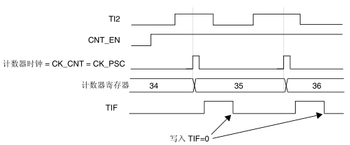

- **CCx通道和TIx是什么关系？**

> 1. CCx通道：CC代表"Capture/Compare"，x代表具体的通道编号。CCx通道是用于捕获或比较的通道，可以通过配置来执行不同的功能。在捕获模式下，CCx通道可以用来捕获外部事件的时间戳或周期。在比较模式下，CCx通道可以与计数器的计数值进行比较，触发相应的动作。
> 2. TIx：TI代表"Timer Input"，x代表具体的通道编号。TIx是计时器输入通道，用于接收外部信号并与计数器进行测量、计时或触发操作。TIx通道可以连接到外部信号源，如传感器、编码器等。
>
> 相比之下，CCx（Capture/Compare）通道则更多地与计数器本身及其比较和捕获功能相关，它提供了一种灵活的配置方式，可以将TIx通道作为其中的一个输入源。但是CCx通道本身并不直接连接到硬件引脚。TIx通道通常使用特定的硬件引脚进行连接，例如TI1通常连接到引脚上的捕获输入源。这样，外部事件产生的信号可以通过相应的硬件引脚输入给TIx通道，实现计数器的相关功能。

- **关于外部时钟源模式2（ETRF）**【2023年7月3日有补充】

> ​	通过在 TIMx_SMCR 寄存器中写入 ECE=1 可选择此模式。
>
> 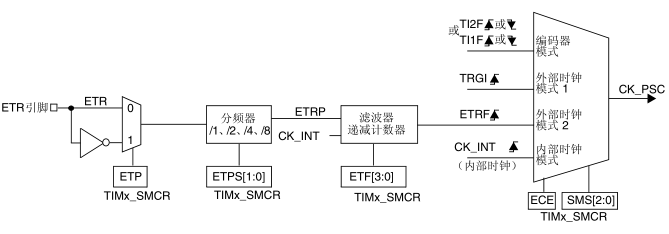
>
> ​	配置要素<u>（递增计数器在 ETR 每出现 2 个上升沿时计数）</u>：
>
> 1. 通过在 TIMx_SMCR 寄存器中写入  SMS=111且ECE=1 来使能外部时钟模式 2。
> 2. 由于此例中不需滤波器，因此在 TIMx_SMCR 寄存器中写入 ETF[3:0]=0000。
> 3. 通过在 TIMx_SMCR 寄存器中写入 ETPS[1:0]=01 来设置预分频器。
> 4. 通过在 TIMx_SMCR 寄存器中写入 ETP=0 来选择 ETR 引脚的上升沿检测。
> 5. 通过在 TIMx_CR1 寄存器中写入 CEN=1 来使能计数器
>
> ETR 每出现 2 个上升沿，计数器计数一次。ETR 的上升沿与实际计数器时钟之间的延迟是由于 ETRP 信号的重新同步电路引起的。
>
> 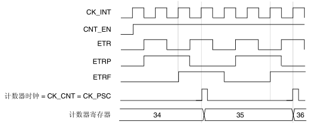

- **关于捕获/比较通道**

> ​	获/比较通道均围绕一个捕获/比较寄存器（包括一个影子寄存器）、一个捕获输入阶段（数字滤波、多路复用和预分频器）和一个输出阶段（比较器和输出控制）构建而成。
>
> ​	捕获/比较模块由一个预装载寄存器和一个影子寄存器组成。始终可通过读写操作访问预装载寄存器。在捕获模式下，捕获实际发生在影子寄存器中，然后将影子寄存器的内容复制到预装载寄存
> 器中。在比较模式下，预装载寄存器的内容将复制到影子寄存器中，然后将影子寄存器的内容与计
> 数器进行比较。
>
> 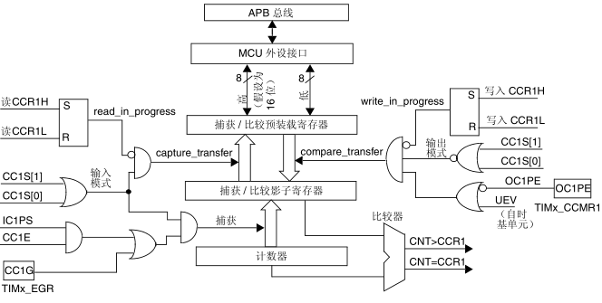
>
> ​	输入阶段对相应的 TIx 输入进行采样，生成一个滤波后的信号 TIxF。然后，带有极性选择功能的边沿检测器生成一个信号 (TIxFPx)，该信号可用作从模式控制器的触发输入，也可用作捕获命令。该信号先进行预分频 (ICxPS)，而后再进入捕获寄存器。
>
> 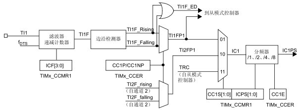
>
> ​	输出阶段生成一个中间波形作为基准：OCxRef（高电平有效）。链的末端决定最终输出信号的极性。
>
> 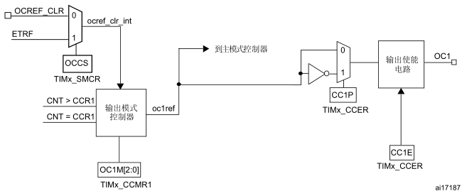
>
> ```TIx和CCx互相映射的用途
> 	每个输入捕获通道仅能够识别一种极性边沿触发（上升沿或下降沿），通过两物理通道TIx映射到同一功能通道，可以实现同时捕获两种极性的边沿。
> ```

- **PWM输入模式的原理**

> ```手册说明
> 此模式是输入捕获模式的一个特例。其实现步骤与输入捕获模式基本相同，仅存在以下不同之处：
> ● 两个 ICx 信号被映射至同一个 TIx 输入。
> ● 这两个 ICx 信号在边沿处有效，但极性相反。
> ● 选择两个 TIxFP 信号之一作为触发输入，并将从模式控制器配置为复位模式。
> 例如，可通过以下步骤对应用于 TI1 的 PWM 的周期（位于 TIMx_CCR1 寄存器中）和占空比（位于 TIMx_CCR2 寄存器中）进行测量（取决于 CK_INT 频率和预分频器的值）：
> ● 选择 TIMx_CCR1 的有效输入：向 TIMx_CCMR1 寄存器中的 CC1S 位写入 01（选择TI1）。
> ● 选择 TI1FP1 的有效极性（用于 TIMx_CCR1 中的捕获和计数器清零）：向 CC1P 位和 CC1NP 位写入“0”（上升沿有效）。
> ● 选择 TIMx_CCR2 的有效输入：向 TIMx_CCMR1 寄存器中的 CC2S 写入 10（选择TI1）。
> ● 选择 TI1FP2 的有效极性（用于 TIMx_CCR2 中的捕获）：向 CC2P 位和 CC2NP 位写入“1”（下降沿有效）。
> ● 选择有效触发输入：向 TIMx_SMCR 寄存器中的 TS 位写入 101（选择 TI1FP1）。
> ● 将从模式控制器配置为复位模式：向 TIMx_SMCR 寄存器中的 SMS 位写入 100。
> ● 使能捕获：向 TIMx_CCER 寄存器中的 CC1E 位和 CC2E 位写入“1”。
> ```
>
> 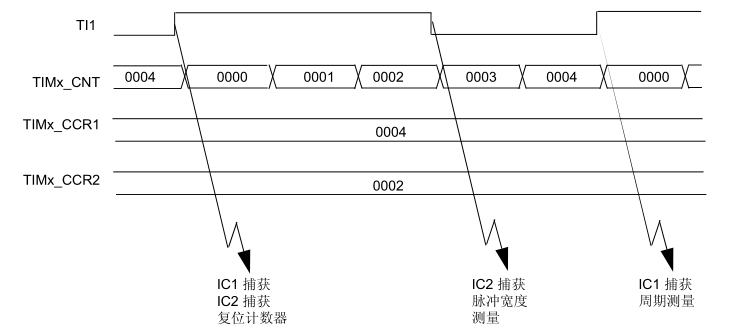
>
> ​	也就是说，将PWM信号从TI1通道输入后，分成正反两相信号给IC1和IC2通道，也就是TI1FP1和TI1FP2；<u>这里TI1FP1设定为有效触发输入，那这里的TIM_CNT不就是触发输入产生的吗？看时序的意思是当触发输入上升沿会将计数器复位，可以从CCR1和CCR2寄存器里分别拿到高电平脉宽和周期脉宽，因此CNT的时钟源应该是独立于被测信号的。</u>

- **关于强制输出模式（输出控制/锁定）**

> ​	在输出模式（TIMx_CCMRx 寄存器中的 CCxS 位 = 00）下，可直接由软件将每个输出比较信号（OCxREF 和 OCx）强制设置为有效电平或无效电平，而无需考虑输出比较寄存器和计数器之间的任何比较结果。
> ​	要将输出比较信号 (OCXREF/OCx) 强制设置为有效电平，只需向相应 TIMx_CCMRx 寄存器中的 OCxM 位写入 101。ocxref 进而强制设置为高电平（OCxREF 始终为高电平有效），同时 OCx 获取 CCxP 极性位的相反值。
> ​	例如：CCxP=0（OCx 高电平有效）=> OCx 强制设置为高电平。
> ​	通过向 TIMx_CCMRx 寄存器中的 OCxM 位写入 100，可将 ocxref 信号强制设置为低电平。无论如何，TIMx_CCRx 影子寄存器与计数器之间的比较仍会执行，而且允许将标志置 1。因此可发送相应的中断和 DMA 请求。
>
> *【寄存器位定义】*
>
> OC1M：输出比较 1 模式 (Output compare 1 mode)
> 这些位定义提供 OC1 和 OC1N 的输出参考信号 OC1REF 的行为。OC1REF 为高电平有效，而 OC1 和 OC1N 的有效电平则取决于 CC1P 位和 CC1NP 位。
> 000：冻结––输出比较寄存器 TIMx_CCR1 与计数器 TIMx_CNT 进行比较不会对输出造成任何影响。（该模式用于生成时基）。
> 001：将通道 1 设置为匹配时输出有效电平。当计数器 TIMx_CNT 与捕获/比较寄存器 1
> (TIMx_CCR1) 匹配时，OC1REF 信号强制变为高电平。
> 010：将通道 1 设置为匹配时输出无效电平。当计数器 TIMx_CNT 与捕获/比较寄存器 1
> (TIMx_CCR1) 匹配时，OC1REF 信号强制变为低电平。
> 011：翻转––TIMx_CNT=TIMx_CCR1 时，OC1REF 发生翻转。
> 100：强制变为无效电平––OC1REF 强制变为低电平。
> 101：强制变为有效电平––OC1REF 强制变为高电平。
> 110：PWM 模式 1––在递增计数模式下，只要 TIMx_CNT<TIMx_CCR1，通道 1 便为有效状态，否则为无效状态。在递减计数模式下，只要 TIMx_CNT>TIMx_CCR1，通道 1 便为无效状态 (OC1REF=0)，否则为有效状态 (OC1REF=1)。
> 111：PWM 模式 2––在递增计数模式下，只要 TIMx_CNT<TIMx_CCR1，通道 1 便为无效状态，否则为有效状态。在递减计数模式下，只要 TIMx_CNT>TIMx_CCR1，通道 1 便为有效状态，否则为无效状态。
> 注意：在 PWM 模式 1 或 PWM 模式 2 下，仅当比较结果发生改变或输出比较模式由“冻结”模式切换到“ PWM ”模式时， OCREF 电平才会发生更改。

<center>2023年7月3日</center>

---

- **关于重复计数器**

> ​	重复计数实际是在计数器溢出和产生更新事件之间加了一层计数，溢出每过规定的计数才产生一次更新中断。
>
> 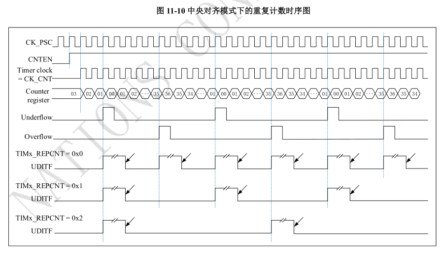

* **关于4种时钟源的几个问题**

1. *外部时钟模式1（TIx）中两种时钟源（TI1F_ED、TI1FP1/TI2FP2）的区别*

> ​	TI1F_ED为双边沿触发，上升和下降边沿都触发一次；TI1FP1/TI2FP2为单边沿触发。

2. *内部触发模式（ITRx）是如何级联的*

> ​	时钟源部分的电路有一个TRGO输出，可以接到下级定时器的ITRx输入接口，实现级联的触发输入。

<center>2023年7月4日</center>

---

* ***一个非常重要的发现——触发输入跟时基单元配置为内部时钟不冲突***

> ​	分析国民技术应用参考资料——利用捕获和触发复位检测PWM输入信号的双边沿以计算周期和占空比，这里用到了时钟源是内部时钟源，即总线时钟源，用于对PWM边沿进行捕获；与此同时，选择TI1FP1为触发信号源，配置为复位模式。每次TI1输入的PWM信号上升沿会触发CNT计数寄存器复位，可以从硬件上直接读取单周期和高电平的持续时间。
>
> ```配置详情
> 
>     /*---------- TIM5 configuration: Output PWM mode ------ */
> 	//配置PWM生成器TIM5
> 	TIM_TimeBaseStructure.Period    = PWMPERIOD - 1;
>     TIM_TimeBaseStructure.Prescaler = PWMPRESCALER - 1;
>     TIM_TimeBaseStructure.ClkDiv    = 0;
>     TIM_TimeBaseStructure.CntMode   = TIM_CNT_MODE_UP;
> 	TIM_InitTimeBase(TIM5, &TIM_TimeBaseStructure);
> 	TIM_OCInitStructure.OcMode      = TIM_OCMODE_PWM1;
>     TIM_OCInitStructure.OutputState = TIM_OUTPUT_STATE_ENABLE;
>     TIM_OCInitStructure.Pulse       = PWMCOMPARE;
>     TIM_OCInitStructure.OcPolarity  = TIM_OC_POLARITY_HIGH;
>     TIM_InitOc1(TIM5, &TIM_OCInitStructure);
> 
>     /* ------TIM3 configuration: Input Capture mode --------- */
> 	//配置捕获时钟源TIM3
> 	TIM_TimeBaseStructure.Period    = CAPTUREPERIOD - 1;
>     TIM_TimeBaseStructure.Prescaler = CAPTUREPPRESCALER - 1;
>     TIM_TimeBaseStructure.ClkDiv    = 0;
>     TIM_TimeBaseStructure.CntMode   = TIM_CNT_MODE_UP;
>     TIM_InitTimeBase(TIM3, &TIM_TimeBaseStructure);
>     //CC1和CC2通道均映射为TI1输入，分别设置上升/下降沿捕获
>     TIM_ICInitStructure.Channel     = TIM_CH_1;
>     TIM_ICInitStructure.IcPolarity  = TIM_IC_POLARITY_RISING;
>     TIM_ICInitStructure.IcSelection = TIM_IC_SELECTION_DIRECTTI;
>     TIM_ICInitStructure.IcPrescaler = TIM_IC_PSC_DIV1;
>     TIM_ICInitStructure.IcFilter    = 0x0;
>     TIM_ICInit(TIM3, &TIM_ICInitStructure);
> 		
> 	TIM_ICInitStructure.Channel     = TIM_CH_2;
>     TIM_ICInitStructure.IcPolarity  = TIM_IC_POLARITY_FALLING;
>     TIM_ICInitStructure.IcSelection = TIM_IC_SELECTION_INDIRECTTI;
> 	TIM_ICInit(TIM3, &TIM_ICInitStructure);
> 	//设置触发输入源为TI1FP1，而且涉及SMSEL[2:0]从模式选择（Slave mode selection）设为000：关闭从模式
> 	TIM_SelectInputTrig(TIM3, TIM_TRIG_SEL_TI1FP1);
> 	//设置SMSEL[2:0]从模式选择（Slave mode selection）设为100：复位模式–选中的触发输入（TRGI）的上升沿
> 	TIM_SelectSlaveMode(TIM3, TIM_SLAVE_MODE_RESET);
> 
>     /* TIM enable counter */
>     TIM_Enable(TIM3, ENABLE);	
> 	TIM_Enable(TIM5, ENABLE);
>     /* Enable the CC2 Interrupt Request */
>     TIM_ConfigInt(TIM3, TIM_INT_CC1 | TIM_INT_CC2, ENABLE);
> ```
>
