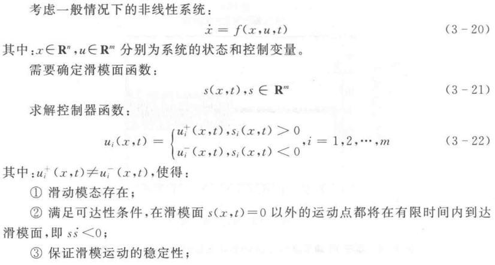
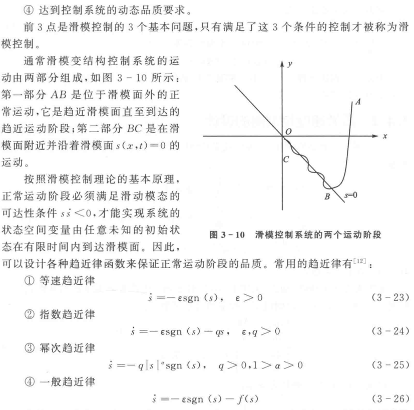
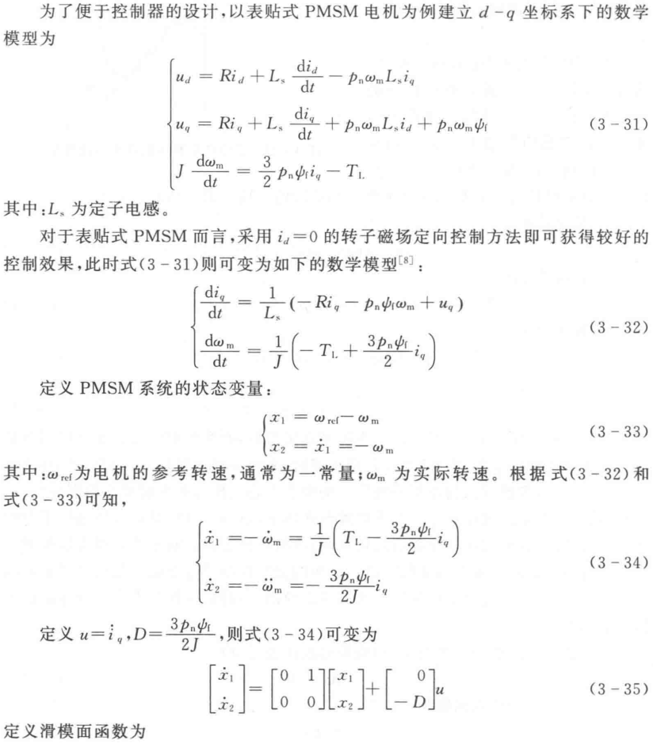

# 电机控制理论学习

2023年7月7日——《永磁同步电机无位置传感器矢量控制系统研究_王润博》论文研究

---

* **永磁同步电机兴起契机——材料**

> 永磁电机已有近年的历史，世界上第一台永磁电机是有巴洛在年发明的。但当时的材料磁性不高，永磁电机也未能得到立即普及，后来被快速发展的励磁电机取代。
>
> 1930年到1950年期间，由于新的铁磁材料的出现，比如锅镇钴，铁氧体等，永磁电机再一次得到了发展。但由于这些材料自身的一些缺点，比如易失磁，磁密度低等，加之电力电子行业当时的发展也有限，永磁电机仍未得到广泛的使用。
>
> 近几十年来，随着电子计算机技术的飞速发展，带动电子技术以及计算机辅助设备的不断进步，加之材料科学的发展，使得永磁电机的性能提高，应用领域迅速增加。
>
> 由于永磁电机自身的诸多优点：**体积小，可控性强，效率高，功率因数高**等。加之近些年来国家对**电机效率和节能要求**逐渐提高，高性能永磁电机已经发展到工业自动化，压缩机，风力发电等各个领域，目前永磁同步电机的材料主要使用：稀土，钕，铁，硼等高性能铁磁材料，之前所提到的易失磁，磁密度低等缺点都得到相应的解决。

* **永磁同步电机应用领域**

> 1. **高精度的伺服控制系统**
>
> 伺服电动机在工业自动化领域的运行控制中扮演了十分重要的角色，应用场合的不同对伺服屯动机的控制性能要求也不尽相同。实际应用中，伺服屯动机有各种不同的控制方式。例如转矩控制、电流控制、速度控制、位置控制等。伺服屯动机系统也经历了直流伺服系统、交流伺服系统、步进系统，直至近年来最为引人注目的永磁屯动机交流伺服系统。最近几年进口的各类自动化设备、自动加工装置和机器人等绝人多数部采用永磁的交流伺服系统。
>
> 2. **电动汽车电机**
>
> 永磁直流无刷电机广泛的被用于电动汽车中，与传统直流电机相比具有以下两个优势：1、寿命长、维护量小、可靠性强。对于普通直流电动机，在电机转速较高的情况下，电刷与换向器之间的磨损较快，一般工作小时左右就需更换电刷。另外其减速齿轮箱的技术难度较大，特别是传动齿轮的润滑问题，是目前有刷方案中比较大的难题。所以普通直流电机就存在噪声大、效率低、易产生故障等问题。因此直流无刷电机的优势很明显。2、效率高、节能。一般而言，因直流无刷电机没有机械换向的磨擦损耗及齿轮箱的消耗，以及调速电路损耗，效率通常可高于85%。但考虑到实际设计中的最高性价比，为减少材料消耗，一般设计为76%。而普通直流电机的效率由于齿轮箱和超越离合器的消耗，通常只有70%左右。

* **永磁电机分类**

> 永磁直流电动机（永磁定子，转子电枢绕组经过电刷和换向器接直流供电）、永磁无刷直流电动机（永磁转子，定子三相绕组由交流矩形波供电）、正弦波永磁同步电动机。

* **永磁同步电机的两种永磁体安装方式**

> 根据永磁体在转子上的安装方式不同，永磁同步电机进一步分为表贴式永磁同步电机、内埋式永磁同步电机和嵌入式永磁同步电机在表贴式永磁步电动机。
>
> 在表贴式永磁同步电机中，永磁体通常片形十转了铁心的外表面上，这种电机的一个重要特点是直轴和交轴的主电感相等，即Ld=Lq。
>
> 内埋式永磁同步电机的永磁体位域转子内部，这样永磁体外表面与定子铁心内圆之叫有铁磁物质制成的极靴可以保护永磁体，这种永磁电机的重要特点是直轴和交轴的主电感不相等。内埋式永磁同步电机与表贴式永磁步电机的性能不同，和表贴式相比内埋式永磁同步电机具有以下优点：首先，内埋式永磁同步电机不需要表贴式永磁同步电机所需的不锈钢外壳；其转子表面形成叠片铁心，转子表面的涡流损耗可以大大减少。其次，由于内埋式永磁同步电机中的交轴主电感Lq大于直轴主电感Ld，使其具有更强的牵引能力和过载能力，同时功率密度也得以提高。而且，内埋式永磁同步电机所使用的永磁体形状多为矩形，与表贴式所使用的瓦片形永磁体相比，可以减少材料制作成本。再次，由于内埋式永磁同步电机能够有效的进行弱磁控制，其调速范围也变得更大。最后，从电机的工业设计方面来讲，内埋式永磁同步电机在机械结构、转速和转矩等特性方面的设计有着更大的自由度。

* **永磁无刷直流电机跟永磁同步电机有什么区别？？**

> 供电不同，前者是正弦波供电，后者为政府交替的方波。

2023年7月8日

---

## 在进行坐标等效变换前，先进行磁场的研究学习

* **磁链相关的公式——电流磁效应、跟磁感应强度的关系**

> 1. 通过以电流磁效应为基础的推导解构电感的概念（电感的概念显然是从电磁理论模型中抽象-封装出来的，用来描述一个物理器件的电磁特性）
>
> $$
> d\overrightarrow{B} = \frac{\mu_0}{4\pi}\cdot\frac{Id\vec{l}\times\vec{r}}{r^3} =\frac{\mu_0}{4\pi}\cdot\frac{Idl\cdot sin\theta}{r^2}\\\vec{B} = \int_L{\frac{\mu_0}{4\pi}\cdot\frac{Id\vec{l}\times\vec{e_r}}{r^2}}
> $$
>
> 其中真空磁导率为
> $$
> \mu_0=4\pi\times 10^{-7} Tm/A
> $$
> 这里有几个系数，可以窥见电生磁场的要素，电流强度、导磁材料、空间衰减。
>
> 磁动势
> $$
> F=Ni
> $$
> 磁通量即通过某一截面积的磁力线总量，跟磁密B(磁感应强度)差一个面积的乘数。在磁路中又类似于电流在电路中的作用。
> $$
> \Phi=\frac{F}{R_m}=B\cdot S
> $$
>
> 磁阻即磁路的阻抗，磁导率\mu越小、线圈截面积越小，线圈厚度越大（磁路越长），磁阻越大。描述的是磁介质的特性。
> $$
> R_m=\frac{l}{\mu\cdot S}
> $$
> 磁链是通过电感的电路决定的，也是磁通通过的线圈匝数决定的。
> $$
> \Psi=N\cdot\Phi=L\cdot i
> $$
> 电感跟磁阻成反比，跟匝数的平方成正比。描述的是磁介质和线圈组成的系统特性。还要知道电感跟磁导率正相关，也就是导磁特性越好，磁阻越小，电感越大，这是在器件内部空间的特性。对于线圈本身，匝数越多，电感越大。
> $$
> L=\frac{N^2}{R_m}=\frac{\mu_0 N^2 S}{l}
> $$

## 三相电等效坐标变换原理

> 三相交流电分别为ia、ib、ic
> $$
> i_a=I_msin(\omega t)\\
> i_b=I_msin(\omega t+\frac{2}{3}\pi)\\
> i_c=I_msin(\omega t-\frac{2}{3}\pi)
> $$
> 同时，三相线圈在空间上的分布如图，相互之间相差120°。
>
> 【图】
>
> 由于磁动势产生的方向与线圈方向有关，与电流大小成正比，可等效的将磁动势矢量看作电流的空间矢量，三相电流空间矢量合成，得到与合成磁动势相对应的合成电流矢量。
> $$
> I_s=I_m(sin(\omega t)+e^{j\frac{2}{3}\pi}sin(\omega t+\frac{2}{3}\pi)+e^{-j\frac{2}{3}\pi}sin(\omega t-\frac{2}{3}\pi))
> =\frac{3}{2}I_me^{j\omega t}
> $$
> 同样的，我们将三相模型简化后，得到的合成空间电流矢量应当与这里Is作用相同。
>
> 对原ia、ib、ic进行\alpha\beta轴分解再相加，得到等效的两相电压分量。但这里增加一个系数，为了保障最终合成的Is是我们想要的效果。（为什么幅值等效的情况下，三相变量在两相坐标上进行分解，会多出一个系数？）
> $$
> I_\alpha=k(i_a-\frac{1}{2}i_b-\frac{1}{2}i_c)\\
> I_\beta=k(\frac{\sqrt 3}{2}i_b-\frac{\sqrt 3}{2}i_c)
> $$
> 对\alpha\beta轴变量进行代换化简，得到
> $$
> i_\alpha=kI_m(sin(\omega t)-\frac{1}{2}sin(\omega t+\frac{1}{3}\pi)-\frac{1}{2}sin(\omega t+\frac{2}{3}\pi))
> =\frac{3}{2}kI_msin(\omega t)\\
> i_\beta=kI_m(\frac{\sqrt 3}{2}sin(\omega t+\frac{1}{3}\pi)-\frac{\sqrt 3}{2}sin(\omega t+\frac{2}{3}\pi))
> =\frac{3}{2}kI_mcos(\omega t)
> $$
> 空间矢量合成
> $$
> I{'_s}=\frac{2}{3}kI_me^{j\omega t}
> $$
>
> *<u>那k取1不就好了吗？矢量坐标系的分解和重合成不会影响最后的矢量和，那为何还一定要加一个系数呢？</u>*
> $$
> \begin{pmatrix}{}i_d\\i_q \\\end{pmatrix}=
> \begin{pmatrix}{}cos\omega t & sin\omega t\\-sin\omega t & cos\omega t\\\end{pmatrix}
> \begin{pmatrix}{}i_\alpha\\i_\beta \\\end{pmatrix}
> $$
>
> 
>

2023年7月28日——《永磁同步电机基础知识》b站视频学习

---

1. 磁通$\Phi$是在一定截面内通过的磁场回路（磁力线）总数，单位WB，类似于电流。  
磁感应强度（磁密）$B$为单位截面积内通过的磁通，单位T，类似于电流密度。  
磁场强度$H$描写磁场源性质的物理量，表征了磁场的源泉的强弱，与环境无关。

2023年8月7日——《现代永磁同步电机控制原理及MATLAB仿真》

---

## 滑膜观测器

1. 背景
  目前，三相永磁交流调速矢量控制系统中的速度控制器普遍采用传统的PI调节器，其算法具有简单、可靠性高及参数整定方便等优点。
  三相PMSM是一个非线性、强耦合的多变量系统，当控制系统受到外界扰动的影响或电机内部参数发生变化时，传统的PI控制方法并不能满足实际的要求。为了提高三相PMSM调速系统的动态品质，利用滑模控制(Sliding Mode Control, SMC)对扰动与参数不敏感、响应速度快等优点进行速度控制器设计。
2. 基本原理
  滑模控制是**变结构控制系统**的一种控制策略。这种控制策略与常规控制的根本区别在于控制的不连续性，即一种使系统结构随时间变化的开关特性。这种特性可以使系统在一定条件下沿规定的状态轨迹作小幅、高频率的上下运动，这就是所谓的“滑动模态”。这种滑膜动态与系统参数和扰动无关，使系统具有很好的鲁棒性。

> 这里定义了滑膜控制的概念和控制阶段，要满足的条件，以及趋近的方式（这直接影响趋近的速度）。

3. 基于滑膜的速度控制器设计

> 从原理上说，构建状态变量和滑膜面函数$s=s(x,t)$的目的都是为了让状态向$s=0$靠近并且稳定在这附近。这个控制模块的**输入称为目标量**，**输出称为被控量**。以上面的公式举例，输入量其实是构建的状态变量$x_1=\omega_ref-\omega_m$，输出量是通过公式推导的式(3-32)中的$i_q$，也就是说，**通过构建一个$i_q$的时域控制方程，实现目标量稳定在0附近的目的。**
> 在构建模块的时候，将输入作为状态变量$x_1$，其导数作为状态变量$x_2$，并构建$s=cx_1+x_2$的滑模面函数，是因为$s=0$等同于$x_2=-cx_1$，即$x_1$的变化率$x_2$与$x_1$本身在任何时刻，符号都是相反的。即当$s>0$，$s$就会减小；$s>0$，$s$就会增大。
> 由于滑膜层面上，$s$的趋近率公式据决定了趋近模态和滑动模态的特性。因此通过构建被控量的时域方程实现趋近方程。
> 推导的链路为 明确输入-构建输入量与被控量之间的关系-构建状态变量为输入量和其导数-对两状态变量求导-构建系统状态方程式(3-27)-构建滑膜面函数-对滑模面函数求导-选取趋近律公式求被控量的函数$u=u(x_1,x_2,s,t)$

