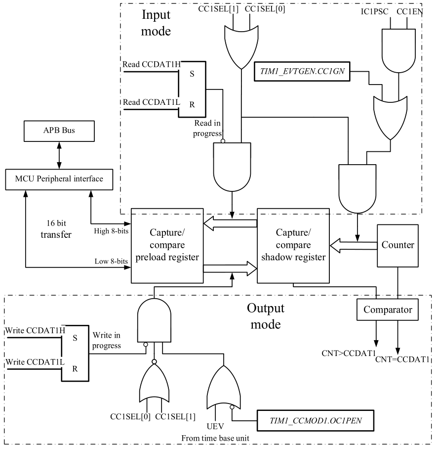
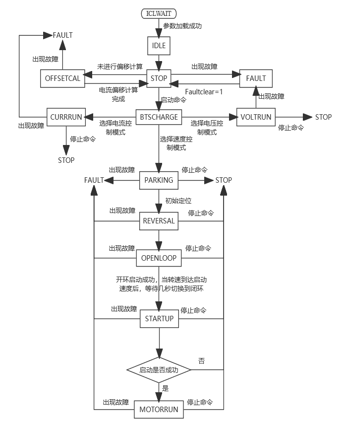

# 电机控制程序学习

<center>2023年6月30日</center>

---

```主程序
int main(void)
{
	//设定系统时钟
	SetSysClockToPLL(SYS_CLOCK_HZ, SYSCLK_PLLSRC_HSIDIV2_PLLDIV2);
	//外设时钟使能——TIM1、TIM2、ADC、GPIOA、GPIOB、GPIOC、AFIO、DMA、COMP、OPAMP
	RCC_Config();
	//时钟安全系统使能
	RCC_EnableClockSecuritySystem(ENABLE);

	//设置了vtimer结构体数组，包含VTIM0和VTIM1，有msec变量和回调函数变量
	vtimer_init();
	//VTIM0作为虚拟时钟操作对象，设定TICK为1，回调函数设定为SystemOperationCycle
	vtimer_SetTimer(SYSTEM_OPERATION_TIMER, SYSTEM_OPERATION_TIMER_TICKS, (void*)SystemOperationCycle);
	
	//电控参数初始化
	MCE_Init();
	
	//初始化3个DMA通道——TIM1_CCDAT4 DMA通道，用于更新采样点；TIM1_DADDR DMA通道，用于更新PWM；ADC_DAT DMA通道，用于获取规则组ADC采样
	DMA_Config();
	//ADC1配置，单电阻采样
	ADC1_Config();
	//外设复用引脚配置——OPAMP、ADC、LED、驱动芯片使能DRIBE_EN
	Peripheral_Config();
	//配置TIM1，1、2、3通道用于SVPWM生成，4通道用于ADC注入采样
	TIM1_Config();
	//配置TIM2，用于ADC规则采样
	TIM2_Config();
	//主程序执行计数、PWM控制程序相关的捕获和更新中断
	TIM3_Config();

	NVIC_Config();
	//使能中断请求
	__enable_irq();
	
	//运行参数初始化，m_LoopFlag循环标志，m_BaseTime时间点记录
	m_LoopFlag = 0;
	m_BaseTime = g_AcqrTime;

	while(1)
	{
      m_DetaTime = - m_BaseTime + g_AcqrTime;
		if (m_DetaTime >= 100)		//日常任务定时，20us一个Tick，100个Tick即2ms
		{
			m_BaseTime += 100;
			//
			GetPulseInHz();
		}
	}
}
```

* **定义vtimer的用意是什么？**

> vtimer即虚拟定时器。对其管理文件（包含变量定义，接口函数）进行解构，发现其主要功能是做倒计时定时。以数组方式定义虚拟定时器组，虚拟定时器本身是一个结构体，包含时间单元变量和回调函数，时间单元变量的单位取决于对其减计数的周期，回调函数的调用在时间单元变量减至0的情况下。相当于一个倒计时的定时器，计时结束调用回调函数做指定的动作。

* **DMA初始化过程中的预处理过程是什么？**

> 预处理命令包括——头文件包含：＃include。 定义一个宏：＃define。 条件编译：＃if、＃else、＃endif。 编译控制：＃pragma。
> 预处理流程——
> ● 头文件展开：将＃include包含的头文件内容展开到当前位置。
> ● 宏展开：展开所有的宏定义，并删除＃define。
> ● 条件编译：根据宏定义条件，选择要参与编译的分支代码，其余的分支丢弃。
> ● 删除注释。
> ● 添加行号和文件名标识：编译过程中根据需要可以显示这些信息。
> ● 保留＃pragma命令：该命令会在程序编译时指示编译器执行一些特定行为。
> ​	这里用到##连接组成新的标识符，在进行之前，对于##两端的标识符中，有宏定义的，应该会先进行一轮宏替换，而没有定义的，则准备直接连接。所以它的顺序可能是——先将所有除##以外的宏定义汇总成list，进行第一轮替换；再对##进行连接，形成新的标识符，加入list并进行第二轮替换。并且整体宏替换应该是线性的。【**考虑到还有链接过程，实际的宏相关编译机制可能更复杂**】

* **DMA的配置细节**
* **ADC的配置细节**
* **OPAMP和ADC的引脚配置细节**

```TIM3中断服务函数
/*******************************************************************************
* Function Name  : TIM3_IRQHandler
* Description    : TIM3中断服务函数。每1.31s触发一次更新中断，每个接收信号的上升沿触发一次捕获中断
* Input          : None
* Output         : 捕获时的CNT寄存器值数组PWM_UP_tim[21]
* Return         : None
*******************************************************************************/
unsigned char NO_sign_flag_counter=0;
unsigned char NO_sign_flag=1,Capture_flag=0,Capture_counter=0;
unsigned short PWM_UP_tim[21];
 
void TIM3_IRQHandler(void)
{
 unsigned char i; 
 if(TIM3->STS&0x0001)//更新中断
 {
    TIM3->STS=TIM3->STS&0xFFFE; //更新中断标志清0
   if(Capture_flag==1)
   {
     if( NO_sign_flag_counter>=22)NO_sign_flag=0;
     Capture_flag=2;
     if(TIM3->STS&0x0004) Capture_flag=1;
   }
   else //两次更新事件中无捕获事件，认为无信号
   {
     Capture_flag=0;
    NO_sign_flag=1;
    NO_sign_flag_counter=0;
   }
 }
 if(TIM3->STS&0x0004)//捕获事件中断
 {
   //------------首次上信号----------//
  if( NO_sign_flag)
   {
     NO_sign_flag_counter++;
     if( NO_sign_flag_counter>=22)
     {
       NO_sign_flag=0;
       NO_sign_flag_counter=22;
     }      
   } 
   TIM3->STS=TIM3->STS&0xFFFB; //捕获标志清0
  //--------------数据更新------------//
   for(i=20;i>0;i--)
   {
     PWM_UP_tim[i]=PWM_UP_tim[i-1];
   }
   PWM_UP_tim[0]=TIM3->CCDAT2;
   //---------------小于50000/65535Hz,大于25000/65535Hz 按无信号处理-----//
  if((Capture_flag==2)&&(PWM_UP_tim[0]>=PWM_UP_tim[1]))
   {
    NO_sign_flag=1;
    NO_sign_flag_counter=0;
   }
   Capture_flag=1;
 }
}

/*******************************************************************************
* Function Name  : GetPulseInHz
* Description    : 读取输入PWM频率。
* Input          : 捕获时的CNT寄存器值数组PWM_UP_tim[21]
* Output         : 运行此函数时的时间戳tim3,输入PWM频率计算结果pinlv,PWMFre_pre
					【有些冗余，作为全局变量，有优化空间】
* Return         : 频率值，单位0.1Hz
*******************************************************************************/

unsigned short tim3=0,pinlv=0,PWMFre_pre=0;

unsigned short GetPulseInHz(void) //2ms一次
{
   unsigned short ReturnValue;
   unsigned short temp1,temp2;
   unsigned char i; 
   static unsigned short signal_wait_counter;
   tim3=TIM3->CNT;
  if(! NO_sign_flag)
  {
    /*计算实时信号平均值*/
     temp2=0;
       for(i=0;i<20;i++)
     {
       if(PWM_UP_tim[i]>PWM_UP_tim[i+1])
       {
         temp1=(unsigned short)(500000/(PWM_UP_tim[i]-PWM_UP_tim[i+1]));
       }
       else
       {
         temp1=(unsigned short)(500000/(PWM_UP_tim[i]+0xFFFF-PWM_UP_tim[i+1]));
       }
        if(temp1>1650)temp1=0;//频率大于165hz
        temp2+=temp1;
        //----------读取数据-----------//
        //Record_about_Fre_PWM(PWM_UP_tim[i],temp1,pinlv);
     }
     ReturnValue= temp2/20;  
     /*1s信号更新*/
     if(abs((PWMFre_pre)-(ReturnValue))>=5)//信号变动大于0.5Hz 1s后更新信号频率
     {
       if(signal_wait_counter++>=500)
       {
         if((ReturnValue>1600)&&(ReturnValue<300))//停机信号，前运行频率不更新
         {          
         }
         else
         PWMFre_pre=ReturnValue;
       }
       else
       {
         ReturnValue=PWMFre_pre;
       }
     }
     else
     {
       ReturnValue=PWMFre_pre;
       signal_wait_counter=0;
     }
  }
  else
  {
     ReturnValue=0;//无信号
     //ShutDownRunCtrl();
  }
 // ReturnValue=1500;
  pinlv=ReturnValue;
  return pinlv;//ReturnValue;	
}
```

* **TIM3中断主要实现什么功能**

​		通过捕捉通道，捕获PWM信号，得到一组时间戳，作为转速的输入源。通过定时更新，约1.31s一次的中断，更新状态——是否有PWM输入。

```TIM1中断服务函数
/*******************************************************************************
* Function Name  : TIM1_BRK_IRQHandler
* Description    : 刹车中断处理
* Input          : None
* Output         : None
* Return         : None
*******************************************************************************/
void TIM1_BRK_IRQHandler(void) 
{	//检测刹车中断
	if (TIM_GetIntStatus(TIM1, TIM_INT_BREAK)) {
		//TIMx_BKDT寄存器中主输出使能位MOEN置1
		TIM1->BKDT |= 1 << 15;
		TIM_ClrIntPendingBit(TIM1, TIM_INT_BREAK);
	}
}
```

* **刹车中断源有哪些事件，是如何配置的？**
* **高级定时器的刹车中断的作用和应用有什么？**


<center>2023年7月3日</center>

---

* **关于定时器1的配置**

```定时器配置
#define  HWC_PWMFreq_Raw			5000.0				//PWM开关频率，单位Hz
#define  HWC_PWMClk_Raw				108000000.0			//PWM时钟频率，单位Hz
//PWM最大计数值
#define  Default_PeriodMax			((u16)(HWC_PWMClk_Raw/HWC_PWMFreq_Raw/2))
#define  T_PRD						Default_PeriodMax	//比较寄存器值
/*******************************************************************************
* Function Name  : TIM1_Config
* Description    : 用于配置TIM1。TIM1的1、2、3通道用于SVPWM生成，4通道用于ADC注入采样
* Input          : None
* Output         : None
* Return         : None
*******************************************************************************/
...
	/* Time Base configuration */
	TIM_TimeBaseStructure.Prescaler	= 0;
	TIM_TimeBaseStructure.CntMode		= TIM_CNT_MODE_CENTER_ALIGN3;
	TIM_TimeBaseStructure.Period		= T_PRD - 1;
	TIM_TimeBaseStructure.ClkDiv		= 0;
	TIM_TimeBaseStructure.RepetCnt	= 0;
	TIM_InitTimeBase(TIM1, &TIM_TimeBaseStructure);
	
	//Channel 1, 2,3 in PWM mode
	TIM_InitOcStruct(&TIM1_OCInitStructure);
	//PWM1，决定了OC1REF电平跟CNT和CCDATx大小关系的映射，互补输出使能
	TIM1_OCInitStructure.OcMode			= TIM_OCMODE_PWM1;
	TIM1_OCInitStructure.OutputState	= TIM_OUTPUT_STATE_ENABLE;
	TIM1_OCInitStructure.OutputNState	= TIM_OUTPUT_NSTATE_ENABLE;
	TIM1_OCInitStructure.Pulse			= T_CC1;
	//选择输出极性，即输出有效状态时为高电平还是低电平
#ifndef POSITIVE_LOGIC_OUT
	TIM1_OCInitStructure.OcPolarity		= TIM_OC_POLARITY_LOW;
	TIM1_OCInitStructure.OcNPolarity	= TIM_OCN_POLARITY_LOW;
#else
	TIM1_OCInitStructure.OcPolarity		= TIM_OC_POLARITY_HIGH;
	TIM1_OCInitStructure.OcNPolarity	= TIM_OCN_POLARITY_HIGH; 
#endif	
	//选择空闲状态电平
	TIM1_OCInitStructure.OcIdleState	= TIM_OC_IDLE_STATE_RESET;
	TIM1_OCInitStructure.OcNIdleState	= TIM_OCN_IDLE_STATE_RESET;
	TIM_InitOc1(TIM1, &TIM1_OCInitStructure);
	TIM_InitOc2(TIM1, &TIM1_OCInitStructure);
	TIM_InitOc3(TIM1, &TIM1_OCInitStructure);
	
	//Channel 4 Configuration in OC 
	TIM1_OCInitStructure.OcMode			= TIM_OCMODE_PWM2;
	TIM1_OCInitStructure.OcPolarity		= TIM_OC_POLARITY_HIGH;
	TIM1_OCInitStructure.OutputState	= TIM_OUTPUT_STATE_ENABLE;
	TIM1_OCInitStructure.OutputNState	= TIM_OUTPUT_STATE_ENABLE;
	TIM1_OCInitStructure.OcIdleState	= TIM_OC_IDLE_STATE_RESET;
	TIM1_OCInitStructure.OcNIdleState	= TIM_OCN_IDLE_STATE_RESET;
	TIM1_OCInitStructure.Pulse = (T_CC4_SP1);
	TIM_InitOc4(TIM1, &TIM1_OCInitStructure);
```

- **配置成员OcMode、OcPolarity/OcNPolarity、OcIdleState/OcNIdleState有什么联系和区别**

> OcMode所定义的PWM模式1/2决定了（CNT计数值与CCDATx比较值的）比较结果和OCxREF信号电平的映射关系，OCxREF的电平值也有另一个叫法，0即无效值，1为有效值。
>
> OcPolarity/OcNPolarity决定了输出通道/互补输出通道的有效值（OCxREF=1）与输出结果OCx的映射关系，即当OCxREF=1时，输出OCx为高电平还是低电平。
>
> OcIdleState/OcNIdleState决定了输出通道/互补输出通道的无效值（OCxREF=0）与输出结果OCx的映射关系，即当OCxREF=0时，输出OCx为高电平还是低电平。
>
> 【非常让人难以接受的是，这些选项竟然可以独立配置，而不是自带一些耦合】。<u>而且这里OcPolarity/OcNPolarity的取值相同，OcIdleState/OcNIdleState取值也相同，是否说明在其前端就已经进行互补转换了？但是死区插入控制作用的是最后一环，即OcPolarity/OcNPolarity端。</u>

* **关于比较值寄存器CCDATx的一些猜想**

> 输出PWM波形时，三个通道的比较值是必须实时更改的，也就是每个周期都会更改一次。将每一个PWM周期对应与CNT值的时域图像上的“V”型波形，每个输出的PWM高电平都是关于"V"中心对称的，而ADC应该配置了多个通道采样，以在不同时间点单电阻采集三相电流，在单周期过半之后，可能是最后一次采样的中断中，进行下一周期参数的计算和CCDATx寄存器的配置。由于这个寄存器的影子机制，刚好会在本周期结束的下溢更新时将配置更新到寄存器，控制下一个周期中三相桥臂的输出脉冲宽度。

* **整理所有中断服务函数**

```所有中断服务函数
//刹车中断
void TIM1_BRK_IRQHandler(void) 
{
	if (TIM_GetIntStatus(TIM1, TIM_INT_BREAK)) {
		TIM1->BKDT |= 1 << 15;
		TIM_ClrIntPendingBit(TIM1, TIM_INT_BREAK);
	}
}

//ADC中断
void ADC_IRQHandler(void) 
{
	u16 usPT1, usPT2;
	BOOL bDir1, bDir2;
	usPT1 = TIM_GetCnt(TIM1);
	bDir1 = (TIM1->CTRL1 & TIM_CTRL1_DIR) ? FALSE : TRUE;
	MCE_CycleTimePT1 = (bDir1 ? usPT1 : (Default_PWMPeriod - usPT1));

	if(ADC_GetIntStatus(ADC, ADC_INT_JENDC) == SET){
		ADC_ClearIntPendingBit(ADC, ADC_INT_JENDC);
		ADC_ClearIntPendingBit(ADC, ADC_INT_ENDC);
		static u32  s_nCntr = 0;
		if(s_nCntr == 0){
			vtimer_UpdateHandler();
		}
		s_nCntr++;
		if(s_nCntr >= MCE_VTIMER_TICKS)
			s_nCntr = 0;
		MCE_HighFreqTask();
	}
	usPT2 = TIM_GetCnt(TIM1);
	bDir2 = (TIM1->CTRL1 & TIM_CTRL1_DIR) ? FALSE : TRUE;
	MCE_CycleTimePT2 = (bDir2 ? usPT2 : (Default_PWMPeriod - usPT2));
	if(MCE_CycleTimePT2 > MCE_CycleTimePT1){
		MCE_CycleTime = MCE_CycleTimePT2 - MCE_CycleTimePT1;
	}
	else{
		MCE_CycleTime = Default_PWMPeriod - MCE_CycleTimePT1 + MCE_CycleTimePT2;
	}
}

//TIM3中断——捕获PWM输入信号
```

* **关于ADC中断的任务频率问题**

> ​	ADC本身中断频率为5kHz（HWC_PWMFreq_Raw）...

<center>2023年7月7日</center>

---

* **定时器的输出比较寄存器TIMx_CCDATy是否有自动重载的影子机制**

> 有。
>
> 

* **底层功能文件的封装解析**

> 1. *mce_globals.h/c*
>
> ```WRAP_s32函数
> /* =================================================================================
> File name:       MCE_GLOBALS.H   
> ===================================================================================*/
> #include "my_types.h"					//有很多底层的基础运算文件是放在头文件里的
> #include "math_const.h"
> #include <math.h>
> //常用的，可简单实现的功能通过宏实现
> #define  GETSIGN(A)			((A) < 0 ? -1 : 1)			//取符号
> #define  GETABS(A)			((A) < 0 ? -(A) : (A))		//取绝对值
> #define  GETNEG(A)			((A) < 0 ?  (A) : -(A))		//取绝对值的相反数
> #define  GETMIN(A, B)		((A) < (B) ? (A) : (B))		//取较小值
> #define  GETMAX(A, B)		((A) < (B) ? (B) : (A))		//取较大值
> //对数运算，但只对特定值，其余都是-1
> #define LOG2(x) \
>   (((x) == 65535 ) ? 16 : \
>    (((x) == (2*2*2*2*2*2*2*2*2*2*2*2*2*2*2)) ? 15 : \
>     (((x) == (2*2*2*2*2*2*2*2*2*2*2*2*2*2)) ? 14 : \
>      (((x) == (2*2*2*2*2*2*2*2*2*2*2*2*2)) ? 13 : \
>       (((x) == (2*2*2*2*2*2*2*2*2*2*2*2)) ? 12 : \
>        (((x) == (2*2*2*2*2*2*2*2*2*2*2)) ? 11 : \
>         (((x) == (2*2*2*2*2*2*2*2*2*2)) ? 10 : \
>          (((x) == (2*2*2*2*2*2*2*2*2)) ? 9 : \
>           (((x) == (2*2*2*2*2*2*2*2)) ? 8 : \
>            (((x) == (2*2*2*2*2*2*2)) ? 7 : \
>             (((x) == (2*2*2*2*2*2)) ? 6 : \
>              (((x) == (2*2*2*2*2)) ? 5 : \
>               (((x) == (2*2*2*2)) ? 4 : \
>                (((x) == (2*2*2)) ? 3 : \
>                 (((x) == (2*2)) ? 2 : \
>                  (((x) == 2) ? 1 : \
>                   (((x) == 1) ? 0 : -1)))))))))))))))))
> /* =================================================================================
> File name:       MCE_GLOBALS.C   （节选）
> ===================================================================================*/
> s16 g_aSinCosTable[256] = SIN_COS_TABLE;//这里的宏在其他的头文件里替代，这也是值得学习的架构方法
> s16 g_aAtanTable[129] 	= ATAN_TABLE;
> /****************************************/
> /* WRAP_s32                             */
> /* upper and lower wrap function        */
> /****************************************/
> /*周期函数的等效索引工具，将整个实数域映射到一段周期内*/
> s32 WRAP_s32(s32 nX, s32 nMax, s32 nMin)
> {
> 	s32 nRes, nGap;
> 	nRes = nX;
> 	nGap = nMax - nMin;
> 	while(nRes > nMax){
> 		nRes -= nGap;
> 	}
> 	while(nRes < nMin){
> 		nRes += nGap;
> 	}
> 	return nRes;
> }
> ```
>
> 2. *math_const.h*
>
> ```MATH_CONST.H代码
> /* =================================================================================
> File name:       MATH_CONST.H   
> ===================================================================================*/
> //常数
> #define q1divSQRT_3					((u16)0x49E6)    //1/sqrt(3)
> #define q2divSQRT_3					((u16)0x93CD)    //2/sqrt(3)
> #define div3						((u16)0x2AAA)    //1/3
> #define qSQRT_3						((u16)0xDDB4)    //sqrt(3)
> #define qSQRT_3div2					((u16)0x6EDA)    //sqrt(3)/2
> /* Offset for cos(Theta)=sin_cos_Table[index_sin+offset] */
> #define OFFSET 							64	
> #define SQRT_3							1.7320508
> #define PIE								3.1415926
> #define SQRT_2							1.4142136
> #define SQRT_6							2.4494897
> 
> #define q0dot5						 	((u16)0x4000)				//0.5
> #define qSqrtd2							((u16)0x6ED9) 				//sqrt3/2
> #define	qSqrt_inverse					((u16)0x5A11)				//sqrt(3)* Vdc_invT
> #define	qSqrtd2_inverse					((u16)0x2D0f)				//(sqrt(3))/2* Vdc_invT
> #define	q3d2_inverse					((u16)0x4E0C)				//3/2* Vdc_invT
> 
> #define SIN_MASK  0x0300
> #define U0_90     0x0200
> #define U90_180   0x0300
> #define U180_270  0x0000
> #define U270_360  0x0100
> 
> //还详细规定了正余弦表和反正切表
> ```
>
> 3. *mce_parameters_raw.h*
>
> ```原始/基础参数
> /* =================================================================================
> File name:       MCE_PARAMETERS_RAW.H   
> ===================================================================================*/
> /*------------------------------------------------------------------------------
> 	控制板硬件参数
> ------------------------------------------------------------------------------*/
> #define  HWC_Vref_Raw			3.3					//ADC参考电压，单位V
> #define  HWC_RBad_Raw			12					//ADC位数
> #define  HWC_RLNH_Raw			4500000.0			//L、N采样电阻1阻值，单位Ω
> #define  HWC_RLNL_Raw			33000.0				//L、N采样电阻2阻值，单位Ω
> #define  HWC_RdcH_Raw			4500000.0			//Vdc采样电阻1阻值，单位Ω
> #define  HWC_RdcL_Raw			33000.0				//Vdc采样电阻2阻值，单位Ω
> #define  HWC_Rabc_Raw			0.1					//多电阻采样电阻阻值，单位Ω
> #define  HWC_Mabc_Raw			5.0					//多电阻采样放大倍数
> #define  HWC_IabcOft_Raw		1.65				//多电阻采样偏置电压，单位V
> #define  HWC_Rshunt_Raw			0.1					//单电阻采样电阻阻值，单位Ω
> #define  HWC_Mshunt_Raw			5.0					//单电阻采样放大倍数
> #define  HWC_IshOft_Raw			1.65				//单电阻采样偏置电压，单位V
> #define  HWC_Mics_Raw			5.0					//电流传感器采样转换系数，单位V/A
> #define  HWC_IicsOft_Raw		1.65				//电流传感器采样偏置电压，单位V
> #define  HWC_Rated_Vdc_Raw		310.0				//额定电压
> #define  HWC_PWMFreq_Raw		5000.0				//PWM开关频率，单位Hz
> #define  HWC_PWMClk_Raw			108000000.0			//PWM时钟频率，单位Hz
> /*VTX1116Y*/
> #define  HWC_DeadTime_Raw				0.5				//切换和死区时间，单位us
> #define  HWC_HardwareDelay_Raw			0.2				//驱动信号硬件延迟，单位us
> #define  HWC_RingingTime_Raw			1.0				//振荡时间，单位us
> #define  HWC_SampleTime_Raw				0.6				//ADC采样时间，单位us
> #define  HWC_ADConvTime_Raw				0.5				//ADC转换时间，单位us
> /*------------------------------------------------------------------------------
> 	程序参数
> ------------------------------------------------------------------------------*/
> #define  PCP_IRegT_Raw		1.0				//电流环更新时间，1=1个PWM周期
> #define  PCP_SpdRegT_Raw	1.0				//速度环更新时间，1=1个PWM周期
> #define  PCP_HFTaskT_Raw	1.0				//高频任务更新时间，1=1个PWM周期
> #define  PCP_LFTaskT_Raw	10.0			//低频任务更新时间，1=1个PWM周期
> #define  PCP_VTimerT_Raw	1.0				//虚拟定时器周期，单位ms
> /*------------------------------------------------------------------------------
> 	电机本体参数(VMU1113YB)
> ------------------------------------------------------------------------------*/
> /*VTX1116Y*/
> #define  MTR_Num_Poles_Raw				6.0			//电机极数
> #define  MTR_Rs_Raw						8.49		//相间电阻，单位Ω
> #define  MTR_Ld_Raw						74.0		//d轴电感，单位mH
> #define  MTR_Lq_Raw						123.0		//q轴电感，单位mH
> #define  MTR_Ke_Raw						27.8		//相反电势常数，有效值，单位Vrms/Krpm
> #define  MTR_J_Raw						0.000245	//惯量，单位kg*m^2
> #define  MTR_Kt_Raw						0.7963		//转矩因数，对应iq电流有效值，单位Nm/A
> /*------------------------------------------------------------------------------
> 	电机运行参数
> ------------------------------------------------------------------------------*/
> #define  OPP_Max_Speed_Raw				4500.0		//运行允许最大速度，单位rpm
> #define  OPP_Low_Speed_Raw				2000.0		//运行低速度，单位rpm
> #define  OPP_Min_Speed_Raw				1200.0		//运行允许最小速度，单位rpm
> #define  OPP_Stop_Speed_Raw				500.0		//停止运行速度，单位rpm
> #define  OPP_OpenLoop_Speed_Raw			500.0		//开环切闭环运行速度，单位rpm
> #define  OPP_StartUp_Speed_Raw			2400.0		//启动速度（第一目标速度），单位rpm
> #define  OPP_Rated_Speed_Raw			3000		//额定转速，单位rpm
> #define  OPP_Rated_Current_Raw			0.95		//额定电流，3000rpm，单位A，VTX1116Y
> #define  OPP_Crit_Over_Volt_Raw			425.0		//严重过高压，单位V
> #define  OPP_Over_Volt_Raw				425.0		//过高压，单位V
> #define  OPP_Under_Volt_Raw				180.0		//低压，单位V
> /*------------------------------------------------------------------------------
> 	电机控制参数
> ------------------------------------------------------------------------------*/
> #define  MCP_ParkAngle_Raw				-30.0			//初始定位位置，单位°
> #define  MCP_ParkTime_Raw				250.0			//初始定位时间，单位ms
> #define  MCP_RevAngle_Raw				90.0			//反转定位旋转角度，单位°
> #define  MCP_RevSpeed_Raw				60.0			//反转定位旋转速度，单位rpm
> #define  MCP_RevHaltTime_Raw			250.0			//反转定位停止时间，单位ms
> #define  MCP_OpenLoopRamp_Raw			5000.0			//开环加速斜坡，单位rpm/s
> #define  MCP_StartUpTime_Raw			5000.0			//启动速度（第一目标速度）停留时间，单位ms
> #define  MCP_VBusBw_Raw					800.0			//母线电压滤波截止频率，单位Hz
> #define  MCP_SpdFiltBw_Raw				5.0				//速度滤波截止频率，单位Hz
> #define  MCP_SpdRegBw_Raw				2.5				//速度环控制带宽，单位Hz，一般最多取电流环1/10左右
> #define  MCP_IabFiltBw_Raw				250.0			//alpha，beta轴电流滤波截止频率，单位Hz
> #define  MCP_IdqFiltBw_Raw				250.0			//dq轴电流滤波截止频率，单位Hz
> #define  MCP_IRegBw_Raw					200.0			//dq轴电流控制带宽，单位Hz
> #define  MCP_IdRegBw_Raw				500.0			//dq轴电流控制带宽，单位Hz
> #define  MCP_IqRegBw_Raw				200.0			//dq轴电流控制带宽，单位Hz
> #define  MCP_LowSpeedLim_Raw			2.12			//低速最大控制电流，有效值，单位A，VTX1116Y
> #define  MCP_MotorRunStart_Raw			1.80			//速度闭环初始电流，有效值，单位A，VTX1116Y
> #define  MCP_MotorLim_Raw				1.80			//最大控制电流，有效值，单位A，VTX1116Y
> #define  MCP_VdqLim_Raw					90.0			//最大电流环输出PWM占空比，单位%
> #define  MCP_Kslide0_Raw				90.0			//初始滑模参数，单位可认为V
> #define  MCP_Kslide_Raw					180.0			//滑模参数，单位可认为V，取MTR_Rs_Raw*MCP_MotorLim_Raw*sqrt(2)+(MTR_Pn*OPP_Max_Speed_Raw*pi/30)*MTR_Flux
> #define  MCP_E0_Raw						0.3				//滑模电流误差门限，单位A
> #define  MCP_EfiltBw_Raw				750.0			//磁链观测器反电势计算带宽，单位Hz
> #define  MCP_FlxTm_Raw					0.01			//磁链观测器时间常数，单位s
> #define  MCP_PLLfn_Raw					50.0			//磁链锁相环PI调节器带宽，单位Hz
> #define  MCP_PLLksi_Raw					1.0				//磁链锁相环阻尼
> #define  MCP_PLLFreqLim_Raw				300.0			//磁链锁相环PI控制器积分环最大输出，单位Hz
> #define  MCP_PrgDelay_Raw				-1.0			//磁链锁相环角度计算程序延迟，单位周期
> #define  MCP_AngOfst_Raw				0.0				//磁链锁相环角度计算偏移，单位°
> #define  MCP_RtrFreqLim_Raw				300.0			//反正切计算角度和速度最大输出频率，单位Hz
> #define  MCP_SPDSMFILTBUFF_SIZE			8				//速度平滑滤波寄存器个数
> 
> #define  MCP_SpdAccStartUp_Raw			500.0			//最大加速度（启动阶段），单位rpm/s
> #define  MCP_SpdDecStartUp_Raw			500.0			//最大减速度（启动阶段），单位rpm/s
> #define  MCP_SpdGapMaxPStartUp_Raw		100.0			//加速时速度指令与实际速度最大差距（启动阶段），单位rpm
> #define  MCP_SpdGapMaxNStartUp_Raw		100.0			//减速时速度指令与实际速度最大差距（启动阶段），单位rpm
> #define  MCP_SpdAcc_Raw					100.0			//最大加速度，单位rpm/s
> #define  MCP_SpdDec_Raw					100.0			//最大减速度，单位rpm/s
> #define  MCP_SpdGapMaxP_Raw				100.0			//加速时速度指令与实际速度最大差距，单位rpm
> #define  MCP_SpdGapMaxN_Raw				100.0			//减速时速度指令与实际速度最大差距，单位rpm
> 
> #define  MCP_FwkStartSpd_Raw			2000.0			//开启弱磁控制速度，单位rpm
> #define  MCP_FwkStopSpd_Raw				1800.0			//关闭弱磁控制速度，单位rpm
> #define  MCP_UsFiltBw_Raw				5.0				//输出电压滤波截止频率，单位Hz
> #define  MCP_FwkVoltLvl_Raw				80.0			//弱磁控制PWM占空比阈值，单位%
> #define  MCP_FwkCurMax_Raw				0.30			//弱磁最大-Id电流，有效值，单位A
> #define  MCP_FwkKp_Raw					0.30			//弱磁控制器参数P，数值1等效于当PWM占空比达到MCP_VdqLim_Raw时输出弱磁最大1A电流
> #define  MCP_FwkKi_Raw					0.50			//弱磁控制器参数I，数值1等效于当PWM占空比达到MCP_VdqLim_Raw时1s时间内积分输出弱磁1A电流
> #define  MCP_IdRegBwFwk_Raw				500.0			//弱磁控制模式d轴电流控制带宽，单位Hz
> #define  MCP_IqRegBwFwk_Raw				200.0			//弱磁控制模式q轴电流控制带宽，单位Hz
> /*------------------------------------------------------------------------------
> 	系统参数
> ------------------------------------------------------------------------------*/
> #define SINGLE_SHUNT
> #define  MCE_USE_FLUXPLL								//使用磁链锁相环
> #ifndef  MCE_USE_FLUXPLL
> 	#define  MCE_USE_ATANFLUX							//使用磁链反正切
> #endif
> 
> #define  MCE_USE_FLUXPLLEXT								//使用扩展磁链锁相环
> #define  MCE_USE_VBUS_COMPENSATE						//使用母线电压补偿
> #define  MCE_USE_FEEDFORWARD							//使用前馈补偿
> #define  MCE_USE_FLUXWEAKENING							//使用弱磁控制
> #define  MCE_USE_IDQREGBWFWK							//弱磁控制改变电流控制带宽
> #define  MCE_USE_CURLIM									//使用电流限幅
> ```
>
> 4. *mce_parameters.h*
>
> ```mce_parameters.h电机参数
> /* =================================================================================
> File name:       MCE_PARAMETERS.H   （节选）
> ===================================================================================*/
> /*------------------------------------------------------------------------------
> 	程序中硬件参数
> ------------------------------------------------------------------------------*/
> #define  Max_ADC_COUNTS			4095.0												//最大ADC读取数值
> #define  Max_Readable_I_Leg		(((HWC_Vref_Raw/2)/HWC_Mabc_Raw)/HWC_Rabc_Raw)		//最大读取多电阻测量电流
> #define  Max_Readable_I_1Shunt	(((HWC_Vref_Raw/2)/HWC_Mshunt_Raw)/HWC_Rabc_Raw)	//最大读取单电阻测量电流
> #define  Max_Readable_I_ICS		((HWC_Vref_Raw/2)/HWC_Mics_Raw)						//最大读取传感器测量电流
> #define  Max_Readable_Vdc		HWC_Vref_Raw*(HWC_RdcL_Raw+HWC_RdcH_Raw)/HWC_RdcL_Raw	//最大读取母线电压值
> #define  RLNH					(HWC_RLNH_Raw/1000)							//L、N采样电阻1阻值，单位Ω
> #define  RLNL					(HWC_RLNL_Raw/1000)							//L、N采样电阻2阻值，单位Ω
> #define  RdcH					(HWC_RdcH_Raw/1000)							//Vdc采样电阻1阻值，单位Ω
> #define  RdcL					(HWC_RdcL_Raw/1000)							//Vdc采样电阻2阻值，单位Ω
> #define  Rabc					HWC_Rabc_Raw								//多电阻采样电阻阻值，单位Ω
> #define  Rshunt					HWC_Rshunt_Raw								//单电阻采样电阻阻值，单位Ω
> ```
>
> 都是*mce_parameters_raw.h*定义的原始参数基础上衍生出来的。

<center>2023年7月10日</center>

---

* **状态机分析**

> 状态列表
>
> |  状态名   |         含义         |    状态名    | 含义 |
> | :-------: | :------------------: | :----------: | :--: |
> |  ICLWAIT  | 等待输入冲击电流限制 |  CATCHSPIN   |      |
> |   IDLE    |                      |   PARKING    |      |
> |   STOP    |                      |   REVERSAL   |      |
> | OFFSETCAL |                      |   OPENLOOP   |      |
> | BTSCHARGE |                      | ANGLESENSING |      |
> |  STARTUP  |                      |   VOLTRUN    |      |
> | MOTORRUN  |                      |   CURRRUN    |      |
> |   FAULT   |                      |   PRESTOP    |      |
>
> 
>
>
> 
>
> 1. ICLWAIT
>
> ```
> ...MCE_StateMachine()
> 	case ICLWAIT:
> 			//输入冲击电流限制器主程序;返回输入冲击电流限制器状态
> 			if(MCE_ICL_Exec() == ICL_INACTIVE){
> 				MCE_State = IDLE;
> 			}
> 			break;
> ...
> 	MCE_ICLState_t	MCE_ICLState	= ICL_ACTIVATION;
> ...MCE_ICLState_t MCE_ICL_Exec()
> 	switch(MCE_ICLState){
> 		default:
> 		case ICL_IDLE:
> 			break;
> 		case ICL_ACTIVATION:
> 			s_usICLTicksCntr++;
> 			if(s_usICLTicksCntr >= MCE_ICL_EXEC_TICKS){
> 				MCE_ICLState = ICL_ACTIVE;
> 			}
> 			break;
> 		case ICL_ACTIVE:
> 			if(MCE_CheckVBus() != MCE_FAULTFLAGS_VBUS_UNDER_VOLT){
> 				ICL_OFF;
> 				MCE_ICLState = ICL_DEACTIVATION;
> 				s_usICLTicksCntr = 0;
> 			}
> 			break;
> 		case ICL_DEACTIVATION:
> 			s_usICLTicksCntr++;
> 			if(s_usICLTicksCntr >= MCE_ICL_EXEC_TICKS){
> 				MCE_ICLState = ICL_INACTIVE;
> 			}
> 			break;
> 		case ICL_INACTIVE:
> 			if(MCE_CheckVBus() == MCE_FAULTFLAGS_VBUS_UNDER_VOLT){
> 				ICL_ON;
> 				MCE_ICLState = ICL_ACTIVATION;
> 				s_usICLTicksCntr = 0;
> 			}
> 			break;
> 		}
> 		return MCE_ICLState;
> ```
>
> ICL子状态机状态变量MCE_ICLState从初始的ICL_ACTIVATION到达要求的ICL_INACTIVE，要经过一次MCE_ICL_EXEC_TICKS毫秒的计数到达ICL_ACTIVE状态，再经过MCE_CheckVBus()函数判断母线电压是否正常（欠压检测），没问题后进入ICL_DEACTIVATION状态，同样经过一次MCE_ICL_EXEC_TICKS毫秒的计数到达ICL_INACTIVE，【可能有些问题】这时ICL状态机返回了要求值ICL_INACTIVE。MCE状态机进入下一个状态IDLE。
>
> 2. IDLE
>
> ```
> 	...
> 		case IDLE:
> 			if(MCE_LoadParameter()){
> 				MCE_ParameterConfigured = TRUE;
> 				MCE_State = STOP;
> 			}
> 			break;
> 	...
> 	/*******************************************************************************
> 
> 	* Function Name  : MCE_LoadParameter
> 	* Description    : 载入参数
> 	* Input          : None
> 	* Output         : None
> 	* Return         : BOOL，返回是否载入成功
> 	*******************************************************************************/
> 	BOOL MCE_LoadParameter(void)
> 	{
> 
> 		return MCE_CheckParameter();
> 	}
> 	/*******************************************************************************
> 	* Function Name  : MCE_CheckParameter
> 	* Description    : 确定参数是否正确
> 	* Input          : None
> 	* Output         : None
> 	* Return         : BOOL，TRUE:正确；FALSE:错误
> 	*******************************************************************************/
> 	BOOL MCE_CheckParameter(void)
> 	{
> 		return TRUE;
> 	}
> ```
>
> 载入参数检查，此版本没有实现功能。参数配置标志位置位后，进入下一个状态STOP。
>
> 3. STOP
>
> 
>
> ```
> ...
> 	case STOP:
> 			if(MCE_SwFaults != MCE_FAULTFLAGS_NO_FAULT){
> 				MCE_PreFault();
> 				MCE_State = FAULT;
> 			}
> 			else if(!MCE_ADCOffsetCalibrated){
> 				MCE_PreOffsetCal();
> 				MCE_State = OFFSETCAL;
> 			}
> 			else if(MCE_Command == COMMAND_START){
> 				MCE_Command = COMMAND_NONE;
> 				if(MCE_CheckCommand()){
> 					MCE_PreBTSCharge();
> 					MCE_State = BTSCHARGE;
> 				}
> 				else{
> 					MCE_Command = COMMAND_NONE;
> 				}
> 			}
> 			break;
> ...
> ```
>
>
> 这里是一个状态机的分叉口，几个if-else分支选项是有优先级的，错误处理放到下面MCE_SwFaults分析。
>
> 在未进行ADC偏置补偿的情况下，即MCE_ADCOffsetCalibrated为0，先进行电流采样偏置的标定前的处理。然后跳转到OFFSETCAL状态。g_IabcCalc好像是一个相电流参数表。
>
> ```
> /*******************************************************************************
> * Function Name  : MCE_PreOffsetCal
> * Description    : 电流采样偏置的标定前的处理
> * Input          : None
> * Output         : None
> * Return         : None
> *******************************************************************************/
> void	MCE_PreOffsetCal(void)
> {
> 	s_usOffsetCalTicksCntr = 0;
> #ifdef SINGLE_SHUNT
> 	g_IabcCalc.lpfOFTsp.Filt = 0;
> 	g_IabcCalc.lpfOFTsp.nFbak = 64*g_IabcCalc.Isp2Raw;
> #else
> 	g_IabcCalc.lpfOFTa.Filt = 0;
> 	g_IabcCalc.lpfOFTa.nFbak = 64*g_IabcCalc.IaRaw;
> 	g_IabcCalc.lpfOFTb.Filt = 0;
> 	g_IabcCalc.lpfOFTb.nFbak = 64*g_IabcCalc.IbRaw;
> 	g_IabcCalc.lpfOFTc.Filt = 0;
> 	g_IabcCalc.lpfOFTc.nFbak = 64*g_IabcCalc.IcRaw;
> #endif
> }
> ```
>
> 在完成上面两项后，才判断给定命令MCE_Command是否是开机，并复位为无命令状态。
>
> ```
> typedef enum
> {
> 	COMMAND_NONE		= 0,	/* 无命令 */
> 	COMMAND_STOP		= 1,	/* 停止电机 */
> 	COMMAND_START		= 2,	/* 开启电机 */
> } MCE_Command_t;
> ```
>
> 如果是开机命令，进一步MCE_CheckCommand()进行命令检查。MCE_CtrlModeSelect选择控制模式，每种模式下主要做阈值判定，只要阈值判定通过，就可以进行自举充电前的处理，并进入下一个状态BTSCHARGE。
>
> ```
> /*******************************************************************************
> * Function Name  : MCE_CheckCommand
> * Description    : 确定命令是否正确
> * Input          : None
> * Output         : None
> * Return         : BOOL，TRUE:正确；FALSE:错误
> *******************************************************************************/
> BOOL MCE_CheckCommand(void)
> {
> 	BOOL bRet = TRUE;
> 	switch(MCE_CtrlModeSelect){
> 		default:
> 		case CTRLMODE_VOLTAGE:
> 			{
> 				s32 nVExt2, nVmax2;
> 				nVExt2	= ((s32)MCE_Vd_Ext)*((s32)MCE_Vd_Ext) + ((s32)MCE_Vq_Ext)*((s32)MCE_Vq_Ext);
> 				nVmax2	= ((s32)MCE_VdqLim)*((s32)MCE_VdqLim);
> 				if(nVExt2 > nVmax2){
> 					bRet = FALSE;
> 				}
> 			}
> 			break;
> 		case CTRLMODE_CURRENT:
> 			if(((MCE_IdRef_Ext > ((s16)MCE_MotorLim)) || (MCE_IdRef_Ext < (-((s16)MCE_MotorLim)))) 
> 				|| ((MCE_IqRef_Ext > ((s16)MCE_MotorLim)) || (MCE_IqRef_Ext < (-((s16)MCE_MotorLim))))){
> 				bRet = FALSE;
> 			}
> 			else{
> 				s32 nIsRef, nIsmax;
> 				nIsRef	= ((s32)MCE_IdRef_Ext)*((s32)MCE_IdRef_Ext) + ((s32)MCE_IqRef_Ext)*((s32)MCE_IqRef_Ext);
> 				nIsmax	= ((s32)MCE_MotorLim)*((s32)MCE_MotorLim);
> 				if(nIsRef > nIsmax){
> 					bRet = FALSE;
> 				}
> 			}
> 			break;
> 		case CTRLMODE_SPEED:
> 			if((GETABS(MCE_TargetSpeed) > 16384) || 
> 				(GETABS(MCE_TargetSpeed) < MCE_MinTargetSpeed)){
> 				bRet = FALSE;
> 			}
> 			break;
> 	}
> 	return bRet;
> }
> //MCE_CtrlModeSelect初始化
> MCE_CtrlMode_t	MCE_CtrlModeSelect				= CTRLMODE_SPEED;
> ```
>
> MCE_PreBTSCharge()主要进行引脚输出状态调整。
>
> ```
> /*******************************************************************************
> * Function Name  : MCE_PreBTSCharge
> * Description    : 自举充电前的处理
> * Input          : None
> * Output         : None
> * Return         : None
> *******************************************************************************/
> void MCE_PreBTSCharge(void)
> {
> 	MCE_BTSChageCompleted = FALSE;
> 	//配置6引脚的推挽输出
> 	Config_UVWLegs2GPIO();
> 	//引脚复位
> 	LEG_UVWPN_OFF;
> 	//后级驱动芯片drive引脚使能
> 	DRIVE_EN;
> 	s_usUTSChargeTicksCntr	= 0;
> 	s_byUTSChargeUVW				= 0;
> }
> ```
>
> 4. BTSCHARGE
>
> 高速任务异步进行自举电容充电。三个阴极管脚轮流打开1ms，同时仅有一个开启。完成后在MCE状态机里跳转到相应的运行模式。
>
> ```
> ...电机状态机MCE_StateMachine()
> 		case BTSCHARGE:
> 			if(MCE_BTSChageCompleted){
> 				MCE_PreCommand();
> 				switch(MCE_CtrlModeSelect){
> 					default:
> 					case CTRLMODE_VOLTAGE:
> 						MCE_State = VOLTRUN;
> 						break;
> 					case CTRLMODE_CURRENT:
> 						MCE_State = CURRRUN;
> 						break;
> 					case CTRLMODE_SPEED:
> 						MCE_PreParking();
> 						MCE_State = PARKING;
> 						break;
> 				}
> 			}
> 			break;
> ...
> ...电机高速任务MCE_HighFreqTask()
>            //轮流充电，即轮流开启UN、VN、WN
>            switch(s_byUTSChargeUVW){
>             default:
>             case 0:
>                 LEG_ONLY_UN_ON;
>                 s_byUTSChargeUVW = 1;
>                 break;
>             case 1:
>                 LEG_ONLY_VN_ON;
>                 s_byUTSChargeUVW = 2;
>                 break;
>             case 2:
>                 LEG_ONLY_WN_ON;
>                 s_byUTSChargeUVW = 0;
>                 break;
>             }
>             //计数MCE_BTSCHARGE_TICKS个毫秒，算充电完成
>             s_usUTSChargeTicksCntr++;
>             if(s_usUTSChargeTicksCntr >= MCE_BTSCHARGE_TICKS){
>                 s_usUTSChargeTicksCntr = 0;
>                 MCE_BTSChageCompleted = TRUE;
>             }
>         }
>         break;
> ...
> ```
>
> 5. PARKING
>
> 停车，即初始定位。在状态机中按优先级进行错误检查-停车命令检查-启动前停车位置检查。在接收到停车命令后，进入预停车状态PRESTOP；若进入启动前停车位置检查的流程，进行反转定位MCE_Parking()，成功后进行反转定位前的一些处理MCE_PreReversal()。
>
> 	...电机状态机MCE_StateMachine()
> 		case PARKING:
> 			if(MCE_SwFaults != MCE_FAULTFLAGS_NO_FAULT){
> 				MCE_PreFault();
> 				MCE_State = FAULT;
> 			}
> 			else if(MCE_Command == COMMAND_STOP){
> 				MCE_Command = COMMAND_NONE;
> 				MCE_State = PRESTOP;
> 				MCE_PreStopVoltCurrMode();
> 			}
> 			else if(MCE_Parking()){
> 				MCE_PreReversal();
> 				MCE_State = REVERSAL;
> 			}
> 			break;
>
> 初始定位函数中MCE_IdRef变量每个毫秒只增加MCE_ParkGain（宏），即控制其Id的变化率，可能在高速任务等日常任务中有其他处理。
>
> ```
> /*******************************************************************************
> * Function Name  : MCE_Parking
> * Description    : 初始定位的一些处理
> * Input          : None
> * Output         : None
> * Return         : BOOL，TRUE:定位结束，FALSE:未完成
> *******************************************************************************/
> BOOL MCE_Parking(void)
> {
> 	BOOL bRet = FALSE;
> 	MCE_IdRef += GETSIGN(MCE_TargetSpeed)* ((s16)MCE_ParkGain);
> 	if(GETABS(MCE_IdRef) >= MCE_LowSpeedLim){
> 		MCE_IdRef = GETSIGN(MCE_TargetSpeed)* ((s16)MCE_LowSpeedLim);
> 		bRet = TRUE;
> 	}
> 	return bRet;
> }
> /*******************************************************************************
> * Function Name  : MCE_PreReversal
> * Description    : 反转定位前的一些处理
> * Input          : None
> * Output         : None
> * Return         : None
> *******************************************************************************/
> void MCE_PreReversal(void)
> {
> 	s_usRevHaltTicksCntr = 0;
> 	MCE_RevAngleAcc = 0;
> 	MCE_REVANGLECALC_MACRO();
> }
> ```
>
> 6. REVERSAL
>
> 老规矩，先错误检查，再停机命令检查，没异常了再干正事。做反转定位的的一些处理MCE_Reversal，并停止MCE_REVHALT_TICKS（取值250ms）后切开环状态OPENLOOP。
>
> ```
> ...电机状态机MCE_StateMachine()
> 		case REVERSAL:
> 			if(MCE_SwFaults != MCE_FAULTFLAGS_NO_FAULT){
> 				MCE_PreFault();
> 				MCE_State = FAULT;
> 			}
> 			else if(MCE_Command == COMMAND_STOP){
> 				MCE_Command = COMMAND_NONE;
> 				MCE_State = PRESTOP;
> 				MCE_PreStopVoltCurrMode();
> 			}
> 			else if(MCE_Reversal()){
> 				//反转定位停止延迟时间，单位次ms
> 				s_usRevHaltTicksCntr++;
> 				if(s_usRevHaltTicksCntr >= MCE_REVHALT_TICKS){
> 					s_usRevHaltTicksCntr = 0;
> 					//开环启动前处理
> 					MCE_PreOpenLoop();
> 					MCE_State = OPENLOOP;
> 				}
> 			}
> 			break;
> ```
>
> 
>
> ```
> /*******************************************************************************
> * Function Name  : MCE_Reversal
> * Description    : 反转定位的的一些处理
> * Input          : None
> * Output         : None
> * Return         : BOOL，TRUE:定位结束，FALSE:未完成
> *******************************************************************************/
> BOOL MCE_Reversal(void)
> {
> 	BOOL bRet = FALSE;
> 	//反转定位旋转角度MCE_RevAngle，从90°折算
> 	if(GETABS(MCE_RevAngleAcc) >= GETABS(MCE_RevAngle)){
> 		bRet = TRUE;
> 	}
> 
> 	return bRet;
> }
> /*******************************************************************************
> * Function Name  : MCE_PreOpenLoop
> * Description    : 开环启动前的一些处理
> * Input          : None
> * Output         : None
> * Return         : None
> *******************************************************************************/
> void MCE_PreOpenLoop(void)
> {
> ...//全是参数初始化操作
> }
> ```
>
> 【MCE_RevAngleAcc应该在高速任务中有变动】
>
> 7. OPENLOOP
>
> ```
> ...电机状态机MCE_StateMachine()//省略掉错误检查和停机命令检查
>             s16 sRet = MCE_OpenLoop();
>             if(sRet == OK){
>                 MCE_PreStartUp();
>                 MCE_State = STARTUP;
>             }
>             else if(sRet == FAIL){
>                 MCE_State = PRESTOP;
>                 MCE_PreStopVoltCurrMode();
>             }
>             else if(GETABS(MCE_SpdRefRamp) >= MCE_OpenLoopTargetSpeed){
>                 s_usOpenLoopTicksCntr++;
>                 if(s_usOpenLoopTicksCntr >= MCE_OPENLOOP_TICKS){
>                     s_usOpenLoopTicksCntr = MCE_OPENLOOP_TICKS;
>                     MCE_PreStartUp();
>                     MCE_State = STARTUP;
>                 }
>             }
> ```
>
> 【这里开环处理的函数中sRet没有做实际功能，只会传回None】此函数主要逐渐增大MCE_SpdRefRamp和MCE_SpdRefRampRaw变量，依据预设的斜率。
>
> 开环定时MCE_OPENLOOP_TICKS（设定100ms）后切闭环，MCE_PreStartUp()函数也主要是参数初始化。
>
> 	/*******************************************************************************
> 	* Function Name  : MCE_OpenLoop
> 	* Description    : 开环启动的一些处理
> 	* Input          : None
> 	* Output         : None
> 	* Return         : s16, OK:成功； NONE:未完成；FAIL:失败
> 	*******************************************************************************/
> 	s16 MCE_OpenLoop(void)
> 	{
> 		s16 sRet = NONE;
> 		MCE_SpdRefRampRaw		+= GETSIGN(MCE_TargetSpeed)*((s32)MCE_OpenLoopRamp);		\
> 		MCE_SpdRefRamp			= MCE_SpdRefRampRaw/1024;									\
> 		if(GETABS(MCE_SpdRefRamp) > MCE_OpenLoopTargetSpeed){								\
> 			MCE_SpdRefRamp			= GETSIGN(MCE_TargetSpeed)*MCE_OpenLoopTargetSpeed;		\
> 			MCE_SpdRefRampRaw		= ((s32)MCE_SpdRefRamp)*1024;							\
> 		}
> 		return sRet;
> 	}
>
> 8. STARTUP
>
> 同样的故障检查和停机命令检查，没问题后进行进入电机运行前的一些处理MCE_StartUp()。成功后计数MCE_STARTUP_TICKS后MCE_PreMotorRun()并跳转到MOTORRUN。
>
> 				s16 sRet = MCE_StartUp();
> 				if(sRet == OK){
> 					s_usStartUpTicksCntr++;
> 					if(s_usStartUpTicksCntr >= MCE_STARTUP_TICKS){
> 						s_usStartUpTicksCntr = 0;
> 						MCE_PreMotorRun();
> 						MCE_State = MOTORRUN;
> 					}
> 				}
> 				else if(sRet == FAIL){
> 					MCE_State = PRESTOP;
> 					MCE_PreStopVoltCurrMode();
> 				}
>
> MCE_PreMotorRun()主要配置速度斜坡。
>
> ```
> /*******************************************************************************
> * Function Name  : MCE_PreMotorRun
> * Description    : 进入电机运行前的一些处理
> * Input          : None
> * Output         : None
> * Return         : None
> *******************************************************************************/
> void MCE_PreMotorRun(void)
> {
> 	g_SpdRamp.SpdAcc					= Default_SpdAcc;
> 	g_SpdRamp.SpdDec					= Default_SpdDec;
> 	g_SpdRamp.SpdGapMaxP			= Default_SpdGapMaxP;
> 	g_SpdRamp.SpdGapMaxN			= Default_SpdGapMaxN;
> }
> ```
>
> 9. MOTORRUN
>
> 在无故障和停机指令情况下仅运行MCE_MotorRun()，将g_SMO.Kslide逐步自增至MCE_Kslide。目标转速判定，传参。
>
> ```
> /*******************************************************************************
> * Function Name  : MCE_MotorRun
> * Description    : 电机运行的一些处理
> * Input          : None
> * Output         : None
> * Return         : None
> *******************************************************************************/
> void MCE_MotorRun(void)
> {
> 	if(g_SMO.Kslide < MCE_Kslide){
> 		g_SMO.Kslide += 1;
> 	}
> 	else{
> 		g_SMO.Kslide = MCE_Kslide;
> 	}
> 	if(GETABS(MCE_TargetSpeed) < MCE_MinTargetSpeed)
> 		MCE_TargetSpeed = 0;
> 	g_SpdRamp.SpdRef	= MCE_TargetSpeed;
> 	g_SpdRamp.Spd			= MCE_SpdRefRamp;
> 	MCE_RGSPDREF_MACRO(g_SpdRamp);
> 	MCE_SpdRefRamp	= g_SpdRamp.SpdRefRamp;
> 	if(GETABS(MCE_SpdRefRamp) < MCE_StopTargetSpeed){
> 		MCE_Command = COMMAND_STOP;
> 	}
> }
> ```

<center>2023年7月11日</center>

---

* **关于MCE_SwFaults错误变量**

> ```
> 【关于MCE_SwFaults错误变量】
> //初始化为MCE_FAULTFLAGS_NO_FAULT
> MCE_SwFaults							= MCE_FAULTFLAGS_NO_FAULT;
> //在每个高速任务MCE_HighFreqTask()的末尾都会更新MCE_SwFaults
> MCE_SwFaults		= MCE_FaultFlags & MCE_FaultEnable;
> //在MCE状态机的STOP、OFFSETCAL、STARTUP、MOTORRUN、PARKING、REVERSAL、OPENLOOP、CURRRUN状态下都会检查
> if(MCE_SwFaults != MCE_FAULTFLAGS_NO_FAULT)...
> //在故障清除函数MCE_ClearFault()中会清除
> 【错误处理】
> /*******************************************************************************
> * Function Name  : MCE_PreFault
> * Description    : 进入故障状态前的一些处理
> * Input          : None
> * Output         : None
> * Return         : None
> *******************************************************************************/
> void MCE_PreFault(void)
> {
> 	MCE_Command = COMMAND_NONE;
> 	MCE_SVPWMINIT_R1_MACRO(g_SVPWM);
> 	MCE_REFRESH_DMABUFF_MACRO();
> 	//输出引脚复位，关断驱动
> 	DRIVE_OFF;
> }
> ```
>
> 

* **关于ADC注入通道的采样对象和触发源**

> 注入通道的采样触发源为TIM1_CC4通道触发输出。
>
> ```
> ...时钟配置TIM1_Config()
> 	//Channel 4 Configuration in OC 
> 	TIM1_OCInitStructure.OcMode			= TIM_OCMODE_PWM2;			//即比较值与CNT上升过程中值相等时，会是上升沿，跟1.2.3通道相反
> 	TIM1_OCInitStructure.OcPolarity		= TIM_OC_POLARITY_HIGH;		//高电平有效
> 	//下边估计直接复制过来了，其实没必要
> 	TIM1_OCInitStructure.OutputState	= TIM_OUTPUT_STATE_ENABLE;
> 	TIM1_OCInitStructure.OutputNState	= TIM_OUTPUT_STATE_ENABLE;
> 	TIM1_OCInitStructure.OcIdleState	= TIM_OC_IDLE_STATE_RESET;
> 	TIM1_OCInitStructure.OcNIdleState	= TIM_OCN_IDLE_STATE_RESET;
> 	TIM1_OCInitStructure.Pulse = (T_CC4_SP1);
> 	TIM_InitOc4(TIM1, &TIM1_OCInitStructure);
> ...
> ...ADC配置ADC1_Config()
> 	/* ADC Injected conversions configuration */ 
> 	ADC_ConfigInjectedSequencerLength(ADC, ADC_INJECTED_CHANNALS_NUMBER);
> 	//注入序列配置
> 	ADC_ConfigInjectedChannel(ADC, ADC_INJECTED_CHANNAL_Isp1, ADC_INJECTED_RANK_Isp1, ADC_SAMP_TIME_13CYCLES5);
> 	ADC_ConfigInjectedChannel(ADC, ADC_INJECTED_CHANNAL_Isp2, ADC_INJECTED_RANK_Isp2, ADC_SAMP_TIME_13CYCLES5);
> 	//配置间断模式。每来一次触发，只进行一次转换，按序列顺序循环触发转换
> 	ADC_ConfigDiscModeChannelCount(ADC, 1);
> 	ADC_EnableInjectedDiscMode(ADC, ENABLE);
> 	//配置外部触发注入转换为TIM1_CC4
> 	ADC_ConfigExternalTrigInjectedConv(ADC, ADC_EXT_TRIG_INJ_CONV_T1_CC4);
> 	ADC_EnableExternalTrigInjectedConv(ADC,ENABLE);
> ...
> 	//【这也太粗糙了，实际就是测一个点为什么要分两通道？】
>     #define ADC_INJECTED_CHANNAL_Isp1			ADC_CH_9_PB0	//第一次采样点电流ADC通道
>     #define ADC_INJECTED_CHANNAL_Isp2			ADC_CH_9_PB0	//第二次采样点电流ADC通道
> ```
>
> **注意间断模式的配置。**
>
> 【每个周期的触发次数问题】应该是单边的——仅上升沿触发。也就是仅触发一次。
>
> 

* **关于ADC规则通道采样的触发和配置**

> 
>
> ```
> ...定时器2配置TIM2_Config()
> 	TIM2_OCInitStructure.OcMode			= TIM_OCMODE_PWM1;
> 	TIM2_OCInitStructure.OutputState	= TIM_OUTPUT_STATE_ENABLE;
> 	TIM2_OCInitStructure.Pulse			= T2_CC2;					//这里值为1，仅在CNT复位瞬间触发短方波信号
> 	TIM2_OCInitStructure.OcPolarity		= TIM_OC_POLARITY_LOW;
> 	TIM2_OCInitStructure.OcIdleState	= TIM_OC_IDLE_STATE_RESET;
> 	TIM_InitOc2(TIM2, &TIM2_OCInitStructure);
> 	//从模式——触发源为ITR0（内部通道接TIM1触发输出）、复位模式（收到触发信号后复位计数器，CNT置0）
> 	TIM_SelectSlaveMode(TIM2,TIM_SLAVE_MODE_RESET);
> 	TIM_SelectInputTrig(TIM2,TIM_TRIG_SEL_IN_TR0);
> ...
> ...TIM1配置（节选）TIM1_Config()
> 	//主模式使能（允许通过TRGO与从计数器同步）、触发输出信号设定为更新信号（RepetCnt设置为0，即每个半周期都触发一次）
> 	TIM_SelectMasterSlaveMode(TIM1, TIM_MASTER_SLAVE_MODE_ENABLE);
> 	TIM_SelectOutputTrig(TIM1, TIM_TRGO_SRC_UPDATE);
> ...
> ...配置ADC规则通道ADC1_Config ()
> 	/* Configure the ADC in continous mode withe a resolutuion equal to 12 bits  */
> 	/* ADC configuration ------------------------------------------------------*/
> 	ADC_InitStruct(&ADC_InitStructure);
> 	//扫描模式使能！一次触发会进行整个序列的采样！
> 	ADC_InitStructure.MultiChEn      = ENABLE;
> 	ADC_InitStructure.ContinueConvEn = DISABLE;
> 	//选择规则采样外部触发源ADC_EXT_TRIGCONV_T2_CC2
> 	ADC_InitStructure.ExtTrigSelect  = ADC_EXT_TRIGCONV_T2_CC2;
> 	ADC_InitStructure.DatAlign       = ADC_DAT_ALIGN_R;
> 	ADC_InitStructure.ChsNumber      = ADC_REGULAR_CHANNALS_NUMBER;
> 	ADC_Init(ADC, &ADC_InitStructure);
> 	/* ADC Regular conversions configuration */
> 	ADC_ConfigRegularChannel(ADC, ADC_REGULAR_CHANNAL_VBus, ADC_REGULAR_RANK_VBus, ADC_SAMP_TIME_13CYCLES5);
> 	ADC_ConfigRegularChannel(ADC, ADC_REGULAR_CHANNAL_VTest, ADC_REGULAR_RANK_VTest, ADC_SAMP_TIME_13CYCLES5);
> 	//禁用间断模式
> 	ADC_EnableDiscMode(ADC, DISABLE);
> 	ADC_EnableExternalTrigConv(ADC, ENABLE);
> ...
> ...//实际测量母线和1.65V
> 	#define ADC_REGULAR_CHANNAL_VBus			ADC_CH_1_PA0	//母线电压ADC通道
> 	#define ADC_REGULAR_CHANNAL_VTest			ADC_CH_2_PA1	//（测试用）
> ```
>
> 

<center>2023年7月12日</center>

---


* **关于程序中的DMA自动传输和相关配置**

> 程序中有3处需要用到DMA触发传输——一是ADC采样结果的传输，二是驱动信号源计数器的比较值寄存器配置（TIM1_CC1.2.3），三是注入采样ADC触发源时间设置（TIM1_CC4）。
>
> 【注意：每次触发仅进行一次DMA传输】
>
> 1. ADC规则采样
>
> ```
> ...DMA_Config(void) 节选
> 	DMA_DeInit(DMA_Channel_Type(ADC_DAT));
> 	DMA_InitStructure.PeriphAddr     = (u32)ADC1_DAT_ADDR;
> 	DMA_InitStructure.MemAddr        = (u32)g_DMABuff_ADC_DAT;
> 	DMA_InitStructure.Direction      = DMA_DIR_PERIPH_SRC;
> 	DMA_InitStructure.BufSize        = ADC_REGULAR_CHANNALS_NUMBER;		//2次传输作为一次循环
> 	DMA_InitStructure.PeriphInc      = DMA_PERIPH_INC_DISABLE;
> 	DMA_InitStructure.DMA_MemoryInc  = DMA_MEM_INC_ENABLE;				//存储器增量模式
> 	DMA_InitStructure.PeriphDataSize = DMA_PERIPH_DATA_SIZE_HALFWORD;
> 	DMA_InitStructure.MemDataSize    = DMA_MemoryDataSize_HalfWord;
> 	DMA_InitStructure.CircularMode   = DMA_MODE_CIRCULAR;				//必须是循环，否则传输完指定数量就关闭通道了
> 	DMA_InitStructure.Priority       = DMA_PRIORITY_HIGH;
> 	DMA_InitStructure.Mem2Mem        = DMA_M2M_DISABLE;
> 	DMA_Init(DMA_Channel_Type(ADC_DAT), &DMA_InitStructure);
> 	DMA_RequestRemap(DMA_REMAP_ADC1, DMA, DMA_Channel_Type(ADC_DAT), ENABLE);	//ADC作为触发源
> 	DMA_EnableChannel(DMA_Channel_Type(ADC_DAT), ENABLE);
> ...
> ...ADC_Config()使能DMA请求
> 	ADC_EnableDMA(ADC, ENABLE);
> 	ADC_Enable(ADC, ENABLE);
> ```
>
> 这里设置的外设地址增量模式，使能地址增量模式，每次传输完都会将目标地址移位。传输次数设置为2，使能循环模式，在2个传输完后恢复原来的地址，循环往复。
>
> 2. 计数器的比较值寄存器配置CC1.2.3
>
> TIM1_DADDR寄存器作为一个缓冲映射寄存器，可以通过TIMx_DCTRL 寄存器相关位配置为DMA连续模式下的不同映射目标地址。目标地址是TIMx的相关寄存器，也就是可以对寄存器进行触发配置，主要用在输出比较值寄存器上。
>
> 【这一寄存器可以实现一次触发多次数据传输】每次触发会传输4个数据，但是DMA端每8个数据一次地址循环（地址复位），是因为中心对齐的计数模式更新触发的周期为PWM周期的一半，而在时钟CNT的上升段和下降段的比较值是不同的，所以一次承载整个周期的上升和下降的比较数据。8长度的数组，前4个为底部更新触发的，后4个为顶部更新触发的。
>
> ```
> ...DMA_Config(void) 节选
> 	DMA_DeInit(DMA_Channel_Type(TIM1_DADDR));
> 	DMA_InitStructure.PeriphAddr     = (u32)TIM1_DADDR_ADDR;
> 	DMA_InitStructure.MemAddr        = (u32)g_DMABuff_TIM1_DADDR;		//TIM1_DCTRL寄存器配置TIM1_DADDR的关系
> 	DMA_InitStructure.Direction      = DMA_DIR_PERIPH_DST;
> 	DMA_InitStructure.BufSize        = 8;								//8次传输作为一个循环
> 	DMA_InitStructure.PeriphInc      = DMA_PERIPH_INC_DISABLE;
> 	DMA_InitStructure.DMA_MemoryInc  = DMA_MEM_INC_ENABLE;
> 	DMA_InitStructure.PeriphDataSize = DMA_PERIPH_DATA_SIZE_HALFWORD;
> 	DMA_InitStructure.MemDataSize    = DMA_MemoryDataSize_HalfWord;
> 	DMA_InitStructure.CircularMode   = DMA_MODE_CIRCULAR;
> 	DMA_InitStructure.Priority       = DMA_PRIORITY_HIGH;
> 	DMA_InitStructure.Mem2Mem        = DMA_M2M_DISABLE;
> 	DMA_Init(DMA_Channel_Type(TIM1_DADDR), &DMA_InitStructure);
> 	DMA_RequestRemap(DMA_REMAP_TIM1_UP, DMA, DMA_Channel_Type(TIM1_DADDR), ENABLE);//只有更新中断作为触发源
> 	DMA_EnableChannel(DMA_Channel_Type(TIM1_DADDR), ENABLE);
> ...
> ...TIM1_Config(void)配置DMA传输
> 	TIM_ConfigDma(TIM1,TIM_DMABASE_CAPCMPDAT1,TIM_DMABURST_LENGTH_4TRANSFERS);	//每次请求触发4次传输，分别对应于4个比较值寄存器
> 	TIM_EnableDma(TIM1,TIM_DMA_UPDATE | TIM_DMA_CC4, ENABLE);
> ...
> ...MCE_Control.c中的宏配置
> 	#define MCE_REFRESH_DMABUFF_MACRO()					\
> 		g_DMABuff_TIM1_DADDR[4]		= g_SVPWM.CMP1a;	\
> 		g_DMABuff_TIM1_DADDR[0]		= g_SVPWM.CMP2a;	\
> 		g_DMABuff_TIM1_DADDR[5]		= g_SVPWM.CMP1b;	\
> 		g_DMABuff_TIM1_DADDR[1]		= g_SVPWM.CMP2b;	\
> 		g_DMABuff_TIM1_DADDR[6]		= g_SVPWM.CMP1c;	\
> 		g_DMABuff_TIM1_DADDR[2]		= g_SVPWM.CMP2c;	\
> 		g_DMABuff_TIM1_DADDR[7]		= g_SVPWM.SP1;		\
> 		g_DMABuff_TIM1_DADDR[3]		= T_PRD;			\
> 		g_DMABuff_TIM1_CCDAT4[0]	= g_SVPWM.SP2;		\
> 		g_DMABuff_TIM1_CCDAT4[1]	= g_SVPWM.SP1;
> ```
>
> 3. 计数器比较值更改CC4
>
> 【为啥更新中断触发的DMA已经改了TIM1_CCDAT4，在CC4本身输出的触发里，还要再改它自己？】
>
> 因为每个周期的后半周期都有两次采样，第一次采样的同时要触发DMA修改比较值，做第二次采样的准备。
>
> ```
> ...
> 	DMA_DeInit(DMA_Channel_Type(TIM1_CCDAT4));
> 	DMA_InitStructure.PeriphAddr     = (u32)TIM1_CCDAT4_ADDR;
> 	DMA_InitStructure.MemAddr        = (u32)g_DMABuff_TIM1_CCDAT4;
> 	DMA_InitStructure.Direction      = DMA_DIR_PERIPH_DST;
> 	DMA_InitStructure.BufSize        = 2;
> 	DMA_InitStructure.PeriphInc      = DMA_PERIPH_INC_DISABLE;
> 	DMA_InitStructure.DMA_MemoryInc  = DMA_MEM_INC_ENABLE;
> 	DMA_InitStructure.PeriphDataSize = DMA_PERIPH_DATA_SIZE_HALFWORD;
> 	DMA_InitStructure.MemDataSize    = DMA_MemoryDataSize_HalfWord;
> 	DMA_InitStructure.CircularMode   = DMA_MODE_CIRCULAR;
> 	DMA_InitStructure.Priority       = DMA_PRIORITY_HIGH;
> 	DMA_InitStructure.Mem2Mem        = DMA_M2M_DISABLE;
> 	DMA_Init(DMA_Channel_Type(TIM1_CCDAT4), &DMA_InitStructure);
> 	DMA_RequestRemap(DMA_REMAP_TIM1_CH4, DMA, DMA_Channel_Type(TIM1_CCDAT4), ENABLE);
> 	DMA_EnableChannel(DMA_Channel_Type(TIM1_CCDAT4), ENABLE);
> ...
> ```
>
> 【注入通道采样在每个周期是两次，那么它的中断触发频率是多少呢？毕竟它关系着状态机和高速任务的运行周期。】
>
> 中断事件中关于注入序列只有注入序列转换结束的事件标志，因此必须是注入序列全部转换完成才能触发中断。
>
> 【注入通道的采样是怎么读取的？】
>
> 注入序列每个通道的数据寄存器的单独的，不是共用的，不存在相互覆盖，因此没必要DMA传输，直接读取即可。

* **高速任务MCE_HighFreqTask()解析**

> 


